# VSD-MJCET-Week9 BabySoC Front End Design and Physical Design 

BabySoC (VSDBabySoC) is a tiny RISC‑V based mixed‑signal SoC that integrates three main IPs—a RISC‑V core (RVMYTH), a PLL, and a DAC—wrapped in a simple top module to demonstrate end‑to‑end front‑end and physical design on an open‑source style flow. At a high level, front‑end design covers architecture, RTL and logical integration, while physical design takes the synthesized netlist through floorplan, placement, CTS, routing and sign‑off to GDS.​

BabySoC front-end design
Architecture: BabySoC targets a simple SoC architecture where the RVMYTH RISC‑V core executes code from its instruction memory, a PLL generates the internal high‑frequency clock from an external reference, and a DAC converts core‑generated digital data (e.g., in register r17) to an analog output.​

IP integration: The three IP blocks (PLL, CPU, DAC) are instantiated in a top‑level wrapper (vsdbabysoc) with well‑defined interfaces for clocks, resets, data and control, forming a minimal SoC test vehicle for multi‑IP integration.​

RTL and simulation: The SoC behavior is described in RTL (Verilog/SystemVerilog) and validated with testbenches to ensure correct instruction execution, clocking behavior and DAC output generation before synthesis.​

Synthesis: RTL is synthesized into a gate‑level netlist targeting a specific technology library, honoring timing, area and power constraints so that the physical design step starts from a clean, timing‑driven netlist.​

BabySoC physical design theory
Inputs and goal: Physical design takes as input the synthesized BabySoC netlist, technology and library files, constraints (timing, power, floorplan), and produces a manufacturable layout database (typically GDSII/OASIS) ready for fabrication.​

Floorplanning: The core area and aspect ratio are defined; the PLL, RVMYTH core and DAC macros are placed, IO pins are assigned, and power planning (power grid, rings, straps) is done to ensure proper IR and electromigration margins.​

Placement and optimization: Standard cells are placed and optimized for timing, congestion and power, while maintaining legal placement and honoring design rules; early static timing analysis uses ideal clocks at this stage.​

Clock tree synthesis (CTS): A clock tree is built from the PLL or pad‑driven clock source to sequential elements in the CPU and other logic, minimizing skew and insertion delay to meet setup/hold constraints.​

Routing and sign‑off: Global and detailed routing connect all nets; then filler and decap cells are inserted, metal fill is applied, and final timing, power, signal‑integrity, and physical verification checks (DRC/LVS) are run before streaming out GDS for tapeout

This document presents the complete physical design implementation of the BabySoC using OpenROAD, covering all stages from floorplanning to post-route parasitic extraction (SPEF generation). The objective of this task is to integrate the theoretical and practical aspects of digital design by executing a full RTL-to-GDSII flow on a real System-on-Chip (SoC).Comprehensive screenshots, step-by-step procedures, and observations are documented to demonstrate the design flow, tools used, challenges encountered, and verification results.

Through this exercise, the BabySoC design undergoes floorplan definition, standard cell placement, routing, and parasitic extraction to reflect a realistic ASIC design process. Each stage is explored to understand how physical parameters—such as floorplan constraints, placement density, and routing topology—affect timing performance and design closure.

The outcome of this work is a fully placed and routed BabySoC layout, accompanied by a generated SPEF file that enables post-route Static Timing Analysis (STA). This provides insight into how parasitic effects influence signal delay and how accurate timing verification is performed in professional VLSI design environments.

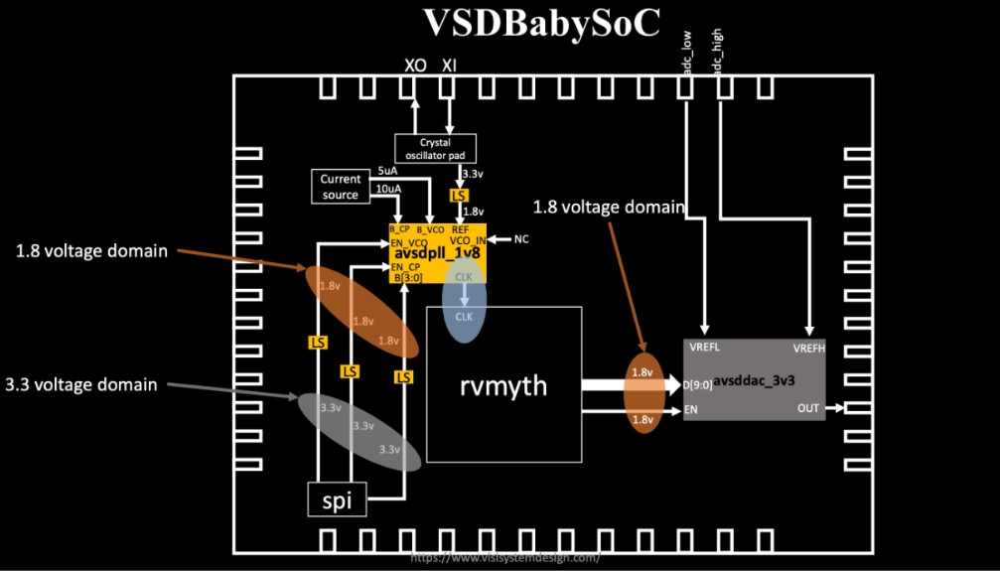

### Setup and Prepare Project Directory
Clone or set up the directory structure as follows:
```txt
VSDBabySoC/
├── src/
│   ├── include/
│   │   ├── sandpiper.vh
│   │   └── other header files...
│   ├── module/
│   │   ├── vsdbabysoc.v      # Top-level module integrating all components
│   │   ├── rvmyth.v          # RISC-V core module
│   │   ├── avsdpll.v         # PLL module
│   │   ├── avsddac.v         # DAC module
│   │   └── testbench.v       # Testbench for simulation
└── output/
└── compiled_tlv/         # Holds compiled intermediate files if needed
```

### 🛠️ Cloning the Project

To begin, clone the VSDBabySoC repository using the following command:

```bash
cd ~/VLSI
git clone https://github.com/manili/VSDBabySoC.git
cd ~/VLSI/VSDBabySoC/
```


### TLV to Verilog Conversion for RVMYTH

Initially, you will see only the `rvmyth.tlv` file inside `src/module/`, since the RVMYTH core is written in TL-Verilog.

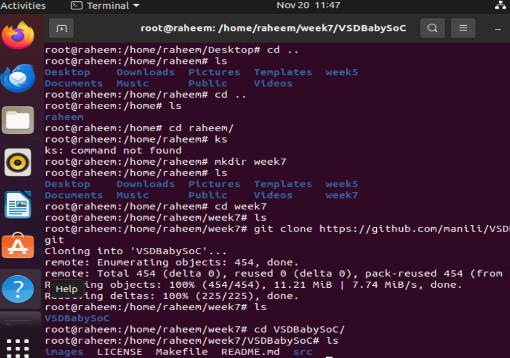

To convert it into a `.v` file for simulation, follow the steps below:

<strong>🔧 TLV to Verilog Conversion Steps</strong>

```bash
# Step 1: Install python3-venv (if not already installed)
sudo apt update
sudo apt install python3-venv python3-pip
```

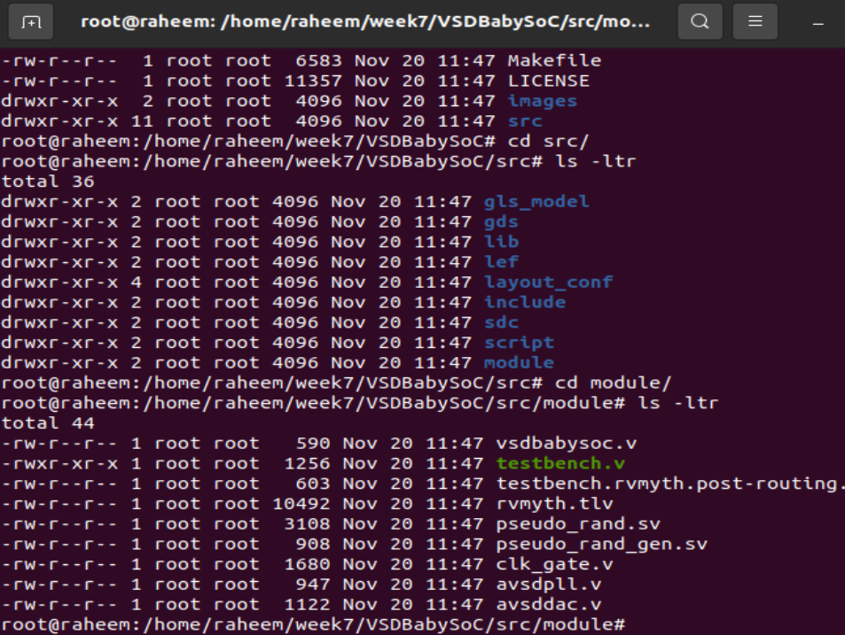

```
# Step 2: Create and activate a virtual environment
cd ~/VLSI/VSDBabySoC/
python3 -m venv sp_env
source sp_env/bin/activate
```

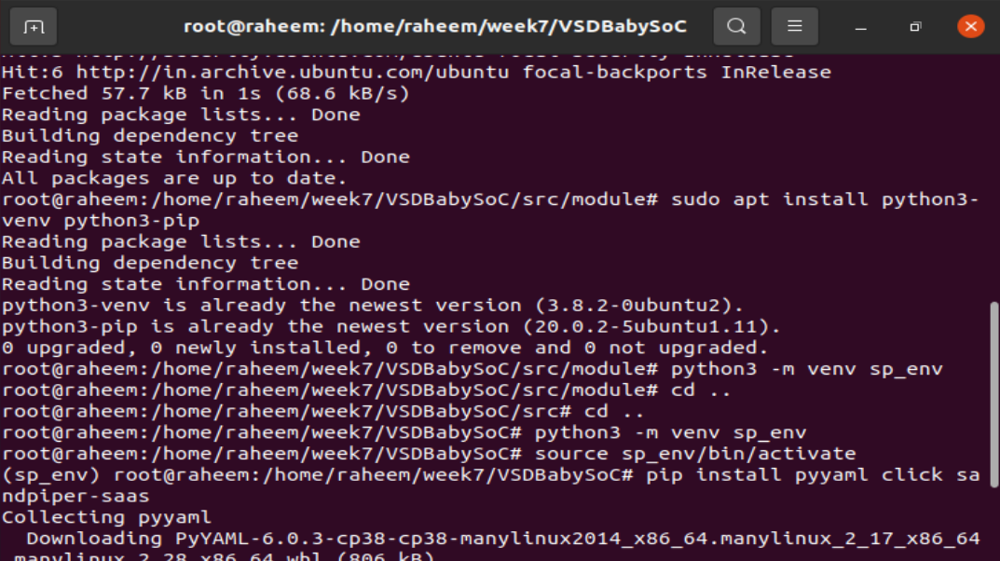

```
# Step 3: Install SandPiper-SaaS inside the virtual environment
pip install pyyaml click sandpiper-saas
```

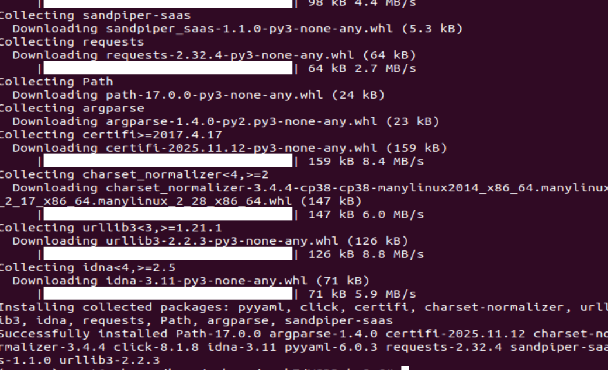

```
# Step 4: Convert rvmyth.tlv to Verilog
sandpiper-saas -i ./src/module/*.tlv -o rvmyth.v --bestsv --noline -p verilog --outdir ./src/module/
```

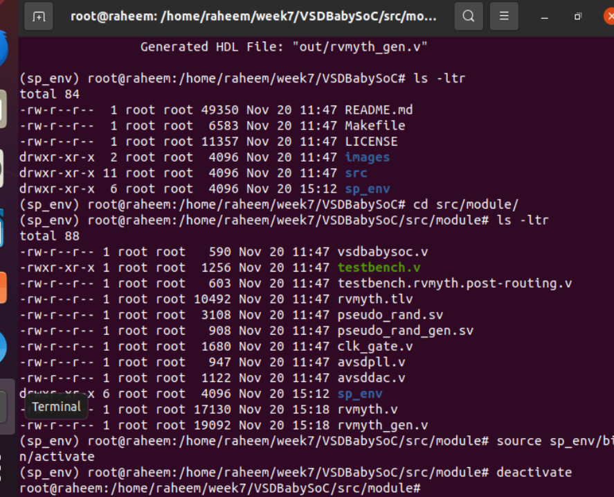

✅ After running the above command, rvmyth.v will be generated in the src/module/ directory.

You can confirm this by listing the files:

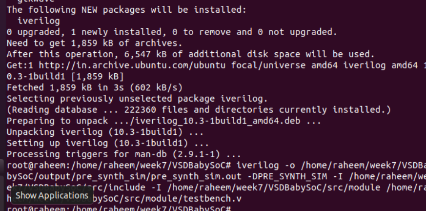

#### Note 
To use this environment in future sessions, always activate it first:
```bash
source sp_env/bin/activate
```
To exit:
```bash
deactivate
```
### Simulation Steps

#### <ins>Pre-Synthesis Simulation</ins>

Run the following command to perform a pre-synthesis simulation:

```bash
cd ~/VLSI/VSDBabySoC/
mkdir -p output/pre_synth_sim
iverilog -o ~/Desktop/VLSI/VSDBabySoC/output/pre_synth_sim/pre_synth_sim.out -DPRE_SYNTH_SIM -I ~/Desktop/VLSI/VSDBabySoC/src/include -I ~/Desktop/VLSI/VSDBabySoC/src/module ~/Desktop/VLSI/VSDBabySoC/src/module/testbench.v
```
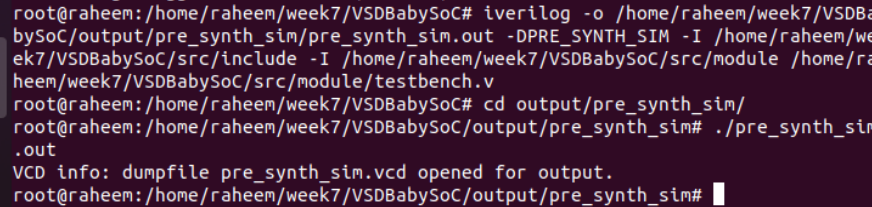

Then run:
```bash
cd output/pre_synth_sim
./pre_synth_sim.out
```
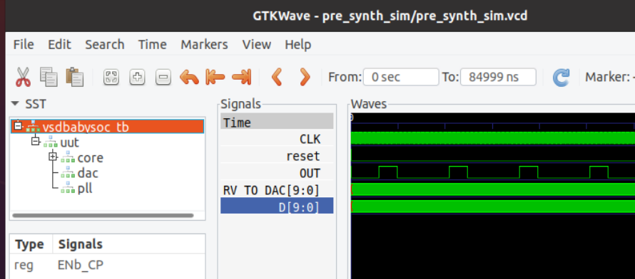

Explanation:

- DPRE_SYNTH_SIM: Defines the PRE_SYNTH_SIM macro for conditional compilation in the testbench.
- The resulting pre_synth_sim.vcd file can be viewed in GTKWave.

#### Viewing Waveform in GTKWave

After running the simulation, open the VCD file in GTKWave: 

```bash

cd ~/VLSI/VSDBabySoC/
gtkwave output/pre_synth_sim/pre_synth_sim.vcd

```
Drag and drop the CLK, reset, OUT (DAC), and RV TO DAC [9:0] signals to their respective locations in the simulation tool

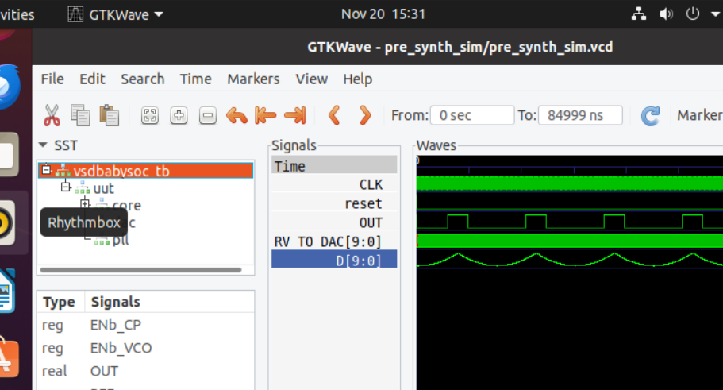

In this picture we can see the following signals:

**CLK**: This is the input CLK signal of the RVMYTH core. This signal comes from the PLL, originally.

**reset**: This is the input reset signal of the RVMYTH core. This signal comes from an external source, originally.

**OUT**: This is the output OUT signal of the VSDBabySoC module. This signal comes from the DAC (due to simulation restrictions it behaves like a digital signal which is incorrect), originally.

**RV_TO_DAC[9:0]**: This is the 10-bit output [9:0] OUT port of the RVMYTH core. This port comes from the RVMYTH register #17, originally.

**OUT**: This is a real datatype wire which can simulate analog values. It is the output wire real OUT signal of the DAC module. This signal comes from the DAC, originally. 

This can be viewed by changing the Data Format of the signal to Analog → Step

#### Viewing DAC output in analog mode

Drag and drop the CLK, reset, OUT (DAC) (as analog step), and RV TO DAC [9:0] signals to their respective locations in the simulation tool 

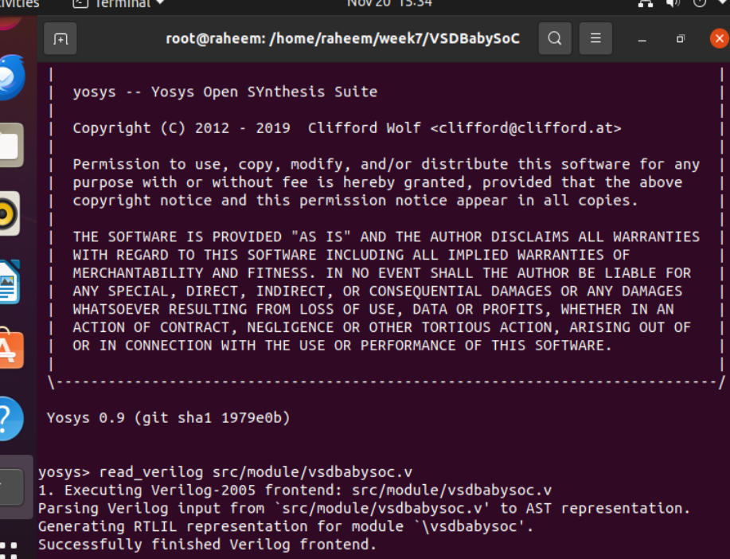

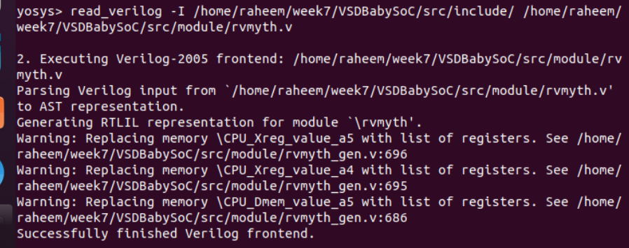

### Trouble shooting tips

   - Module Redefinition: If you encounter redefinition errors, ensure modules are included only once, either in the testbench or in the command line.
   - Path Issues: Verify paths specified with -I are correct. Use full paths if relative paths cause errors.

## Why Pre-Synthesis and Post-Synthesis?

1. **Pre-Synthesis Simulation**: 
   - Focuses only on verifying functionality based on the RTL code.
   - Zero-delay environment, with events occurring on the active clock edge.

2. **Post-Synthesis Simulation (GLS)**:
   - Uses the synthesized netlist (gate-level) to simulate both functionality and timing.
   - Identifies timing violations and potential mismatches (e.g., unintended latches).
   - Helps verify dynamic circuit behavior that static methods may miss.

## VSDBabySoC Post-Synthesis Simulation

Post-synthesis simulation is a critical step in the digital design flow, providing insights into both the functionality and timing of the synthesized design. 

Unlike pre-synthesis simulation, which focuses solely on verifying the functionality based on the RTL code, post-synthesis simulation uses the synthesized netlist to ensure that the design behaves correctly in terms of both logic and timing.

Key aspects of post-synthesis simulation include:

**Functionality and Timing Verification**: It checks the design's functionality and timing using the gate-level netlist, helping identify timing violations and potential mismatches such as unintended latches.

**Dynamic Circuit Behavior**: Post-synthesis simulation can reveal dynamic circuit behaviors that static methods might miss, ensuring the design operates correctly under real-world conditions.

**Identifying Issues**: It helps in identifying issues that may not be apparent in pre-synthesis simulations, such as glitches or race conditions due to the actual gate delays.

The first step in the design flow is to synthesize the generated RTL code, followed by simulating the result. This process helps uncover more about the code and its potential bugs. In this section, we will synthesize our code and then perform a post-synthesis simulation to look for any issues. Ideally, the post-synthesis and pre-synthesis (modeling section) results should be identical, confirming that the synthesis process has not altered the original design behavior.

#### Why do pre-synthesis simulation? Why not just do post-synthesis simulation?
Pre-synthesis simulation is crucial for verifying the logical functionality of a digital design before it undergoes synthesis. It allows designers to detect and correct logical errors, such as incorrect operator usage or unintended latch inference, early in the development process. This type of simulation focuses solely on the high-level behavior of the design, enabling faster iterations and design exploration without the constraints of gate-level details. On the other hand, post-synthesis simulation, or gate-level simulation, is essential for timing verification and ensuring that the synthesized design meets real-world performance requirements. It accounts for gate delays and helps identify any synthesis-induced issues, providing a final validation of both functionality and timing before the design is implemented in hardware. Together, these simulations ensure a robust and reliable digital design.

Here is the step-by-step execution plan for running the  commands manually:
---
### **Step 1: Load the Top-Level Design and Supporting Modules**
- Launch the yosys synthesis tool from your working directory.
```bash
yosys
```
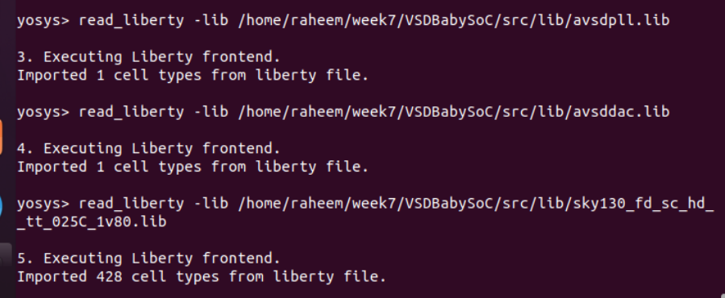
 
- Read the main vsdbabysoc.v RTL file into the yosys environment.
```bash
yosys> read_verilog src/module/vsdbabysoc.v 
```
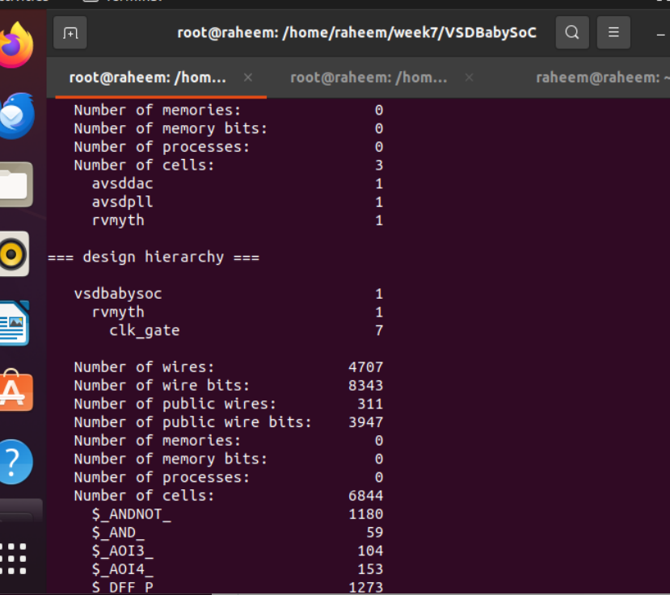

- The following cp commands copy essential header files from the src/include directory into the working directory. These include:

  **sp_verilog.vh** – contains Verilog definitions and macros

  **sandpiper.vh** – holds integration-related definitions for SandPiper

  **sandpiper_gen.vh** – may include auto-generated or tool-generated parameters

```bash
cd ~/Desktop/VLSI/VSDBabySoC
cp -r src/include/sp_verilog.vh .
cp -r src/include/sandpiper.vh .
cp -r src/include/sandpiper_gen.vh .
ls
```

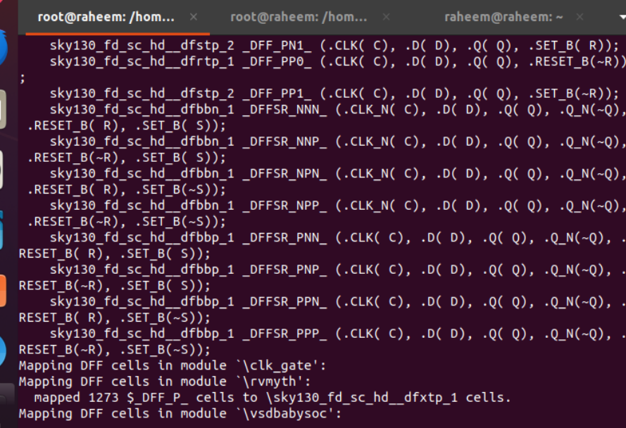

- Read the rvmyth.v file with the include path using -I option.
```bash
yosys> read_verilog -I ~/Desktop/VLSI/VSDBabySoC/src/include/ ~/Desktop/VLSI/VSDBabySoC/src/module/rvmyth.v
```
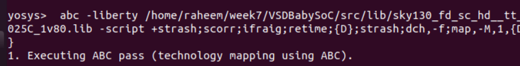

#### ❗Note:

_If you try to read the rvmyth.v file using yosys without copying the necessary header files first, you may encounter errors.

_To avoid these errors, make sure to copy the required include files into your working directory! This ensures Yosys can resolve them correctly during parsing, even if the -I option is used._

- Read the clk_gate.v file with the include path using -I option.

```bash
yosys> read_verilog -I ~/Desktop/VLSI/VSDBabySoC/src/include/ ~/Desktop/VLSI/VSDBabySoC/src/module/clk_gate.v
```

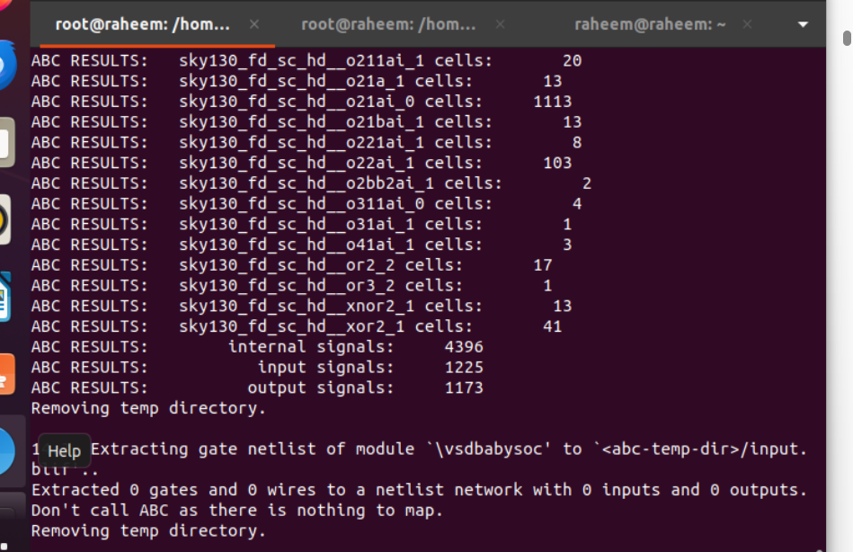

### **Step 2: Load the Liberty Files for Synthesis**
Inside the same yosys shell, run:
```bash
read_liberty -lib ~/Desktop/VLSI/VSDBabySoC/src/lib/avsdpll.lib 
read_liberty -lib ~/Desktop/VLSI/VSDBabySoC/src/lib/avsddac.lib 
read_liberty -lib ~/Desktop/VLSI/VSDBabySoC/src/lib/sky130_fd_sc_hd__tt_025C_1v80.lib
```
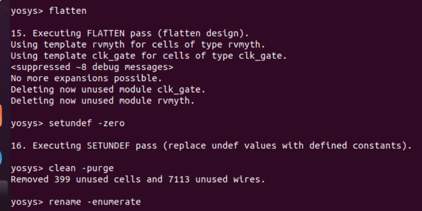

### **Step 3: Run Synthesis Targeting `vsdbabysoc`**
```bash
yosys> synth -top vsdbabysoc
```


### **Step 4: Map D Flip-Flops to Standard Cells**

```bash
yosys> dfflibmap -liberty ~/Desktop/VLSI/VSDBabySoC/src/lib/sky130_fd_sc_hd__tt_025C_1v80.lib
```
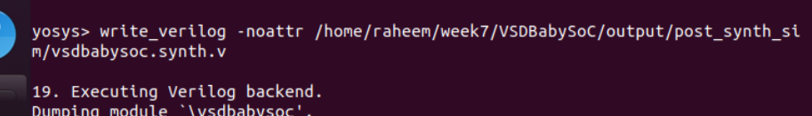

### **Step 5: Perform Optimization and Technology Mapping**
```bash
yosys> opt
yosys> abc -liberty ~/Desktop/VLSI/VSDBabySoC/src/lib/sky130_fd_sc_hd__tt_025C_1v80.lib -script +strash;scorr;ifraig;retime;{D};strash;dch,-f;map,-M,1,{D}
```

| Step           | Purpose                                                              |
| -------------- | -------------------------------------------------------------------- |
| `strash`       | Structural hashing (reduces logic redundancy)                        |
| `scorr`        | Sequential sweeping for redundancy removal                           |
| `ifraig`       | Incremental FRAIGing (logic equivalence checking and optimization)   |
| `retime;{D}`   | Move registers across combinational logic to optimize timing         |
| `strash`       | Re-run structural hashing after retiming                             |
| `dch,-f`       | Delay-aware combinational optimization with fast mode                |
| `map,-M,1,{D}` | Map logic to gates minimizing area (`-M,1`) and retime-aware (`{D}`) |


### **Step 6: Perform Final Clean-Up and Renaming**

```bash
yosys> flatten
yosys> setundef -zero
yosys> clean -purge
yosys> rename -enumerate
```
| **Command**         | **Purpose / Usage**                                                                    |
| ------------------- | -------------------------------------------------------------------------------------- |
| `flatten`           | Flattens the entire design hierarchy into a single-level netlist.                      |
| `setundef -zero`    | Replaces all undefined (`x`) logic values with logical `0` to avoid simulation issues. |
| `clean -purge`      | Removes all unused wires, cells, and modules; `-purge` makes it more aggressive.       |
| `rename -enumerate` | Renames internal wires and cells to unique, numbered names for consistency.            |


### **Step 7: Check Statistics**
```bash
yosys> stat
```
13. Printing statistics.
```shell
=== vsdbabysoc ===

   Number of wires:               4709
   Number of wire bits:           6183
   Number of public wires:        4709
   Number of public wire bits:    6183
   Number of memories:               0
   Number of memory bits:            0
   Number of processes:              0
   Number of cells:               5885
     avsddac                         1
     avsdpll                         1
     sky130_fd_sc_hd__a2111oi_0      8
     sky130_fd_sc_hd__a211oi_1      12
     sky130_fd_sc_hd__a21boi_0       3
     sky130_fd_sc_hd__a21o_2         4
     sky130_fd_sc_hd__a21oi_1      682
     sky130_fd_sc_hd__a221oi_1     165
     sky130_fd_sc_hd__a22oi_1      133
     sky130_fd_sc_hd__a311oi_1       8
     sky130_fd_sc_hd__a31oi_1      333
     sky130_fd_sc_hd__a32o_1         1
     sky130_fd_sc_hd__a32oi_1        2
     sky130_fd_sc_hd__a41oi_1       13
     sky130_fd_sc_hd__and2_2         3
     sky130_fd_sc_hd__and3_2         1
     sky130_fd_sc_hd__clkinv_1     579
     sky130_fd_sc_hd__dfxtp_1     1144
     sky130_fd_sc_hd__lpflow_inputiso0p_1      1
     sky130_fd_sc_hd__mux2i_1       11
     sky130_fd_sc_hd__nand2_1      823
     sky130_fd_sc_hd__nand3_1      278
     sky130_fd_sc_hd__nand3b_1       1
     sky130_fd_sc_hd__nand4_1       48
     sky130_fd_sc_hd__nor2_1       388
     sky130_fd_sc_hd__nor3_1        33
     sky130_fd_sc_hd__nor3b_1        1
     sky130_fd_sc_hd__nor4_1         6
     sky130_fd_sc_hd__o2111a_1       2
     sky130_fd_sc_hd__o2111ai_1     24
     sky130_fd_sc_hd__o211ai_1      48
     sky130_fd_sc_hd__o21a_1         8
     sky130_fd_sc_hd__o21ai_0      867
     sky130_fd_sc_hd__o21bai_1      13
     sky130_fd_sc_hd__o221ai_1       6
     sky130_fd_sc_hd__o22ai_1      154
     sky130_fd_sc_hd__o311ai_0       4
     sky130_fd_sc_hd__o31ai_1        1
     sky130_fd_sc_hd__o41ai_1        2
     sky130_fd_sc_hd__or2_2         14
     sky130_fd_sc_hd__or4_2          1
     sky130_fd_sc_hd__xnor2_1       16
     sky130_fd_sc_hd__xor2_1        42
```

### **Step 8: Write the Synthesized Netlist**
```bash

yosys> write_verilog -noattr ~/Desktop/VLSI/VSDBabySoC/output/post_synth_sim/vsdbabysoc.synth.v
```
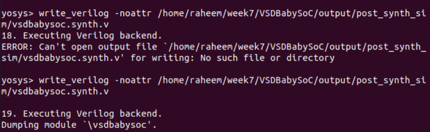

## POST_SYNTHESIS SIMULATION AND WAVEFORMS
---

### **Step 1: Compile the Testbench**

Before running the iverilog command, copy the necessary standard cell and primitive models:
These files must be present in the same directory as the testbench (src/module) to resolve all module references during compilation.

You need to have sky130RTLDesignAndSynthesisWorkshop directory you can clone it from this [link](https://github.com/kunalg123/sky130RTLDesignAndSynthesisWorkshop)

```bash
~/Desktop/VLSI/VSDBabySoC/src/module$ cp -r ~/Desktop/VLSI/sky130RTLDesignAndSynthesisWorkshop/my_lib/verilog_model/sky130_fd_sc_hd.v .
~/Desktop/VLSI/VSDBabySoC/src/module$ cp -r ~/Desktop/VLSI/sky130RTLDesignAndSynthesisWorkshop/my_lib/verilog_model/primitives.v .
```

To ensure that the synthesized Verilog file _(vsdbabysoc.synth.v)_ is available in the src/module directory for further processing or simulation, you can copy it from the output directory to the src/module directory. Here is the step to do that:
```bash
~/Desktop/VLSI/VSDBabySoC$ cp -r ~/Desktop/VLSI/VSDBabySoC/output/post_synth_sim/vsdbabysoc.synth.v ~/Desktop/VLSI/VSDBabySoC/src/module/
```

Run the following `iverilog` command to compile the testbench:
```bash
iverilog -o ~/Desktop/VLSI/VSDBabySoC/output/post_synth_sim/post_synth_sim.out -DPOST_SYNTH_SIM -DFUNCTIONAL -DUNIT_DELAY=#1 -I ~/Desktop/VLSI/VSDBabySoC/src/include -I ~/Desktop/VLSI/VSDBabySoC/src/module ~/Desktop/VLSI/VSDBabySoC/src/module/testbench.v
```

| **Option / Argument**                                                      | **Purpose / Description**                                                            |
| -------------------------------------------------------------------------- | ------------------------------------------------------------------------------------ |
| `iverilog`                                                                 | Icarus Verilog compiler used to compile Verilog files into a simulation executable.  |
| `-o /home/raheem/Desktop/VLSI/VSDBabySoC/output/post_synth_sim/post_synth_sim.out` | Specifies the output binary file for simulation.                                     |
| `-DPOST_SYNTH_SIM`                                                         | Defines the macro `POST_SYNTH_SIM` (used in testbench to switch simulation modes).   |
| `-DFUNCTIONAL`                                                             | Defines `FUNCTIONAL` to use behavioral models instead of detailed gate-level timing. |
| `-DUNIT_DELAY=#1`                                                          | Assigns a unit delay of `#1` to all gates for post-synthesis simulation.             |
| `-I /home/raheem/Desktop/VLSI/VSDBabySoC/src/include`                              | Adds the `include` directory to the search path for `\`include\` directives.         |
| `-I /home/raheem/Desktop/VLSI/VSDBabySoC/src/module`                               | Adds the `module` directory to the include path for additional module references.    |
| `/home/raheem/Desktop/VLSI/VSDBabySoC/src/module/testbench.v`                      | Specifies the testbench file as the top-level design for simulation.                 |

#### ❗Note - You may encounter this error:
```bash
iverilog -o ~/Desktop/VLSI/VSDBabySoC/output/post_synth_sim/post_synth_sim.out -DPOST_SYNTH_SIM -DFUNCTIONAL -DUNIT_DELAY=#1 -I ~/Desktop/VLSI/VSDBabySoC/src/include -I ~/Desktop/VLSI/VSDBabySoC/src/module ~/Desktop/VLSI/VSDBabySoC/src/module/testbench.v
/home/vsduser/Desktop/VLSI/VSDBabySoC/src/module/sky130_fd_sc_hd.v:74583: syntax error
I give up.
```
_To resolve this : Update the syntax in the file sky130_fd_sc_hd.v at or around line 74452._

###### Change:
```bash
`endif SKY130_FD_SC_HD__LPFLOW_BLEEDER_FUNCTIONAL_V
```
###### To:
```bash
`endif // SKY130_FD_SC_HD__LPFLOW_BLEEDER_FUNCTIONAL_V
```
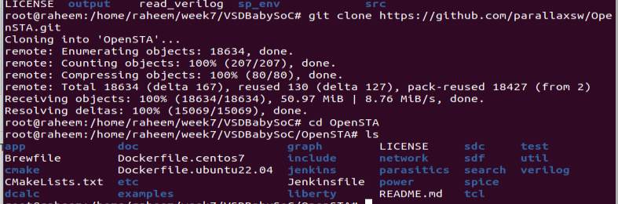

---
### **Step 2: Navigate to the Post-Synthesis Simulation Output Directory**
```bash
cd output/post_synth_sim/
```

### **Step 3: Run the Simulation**

```bash
iverilog -o ~/Desktop/VLSI/VSDBabySoC/output/post_synth_sim/post_synth_sim.out -DPOST_SYNTH_SIM -DFUNCTIONAL -DUNIT_DELAY=#1 -I ~/Desktop/VLSI/VSDBabySoC/src/include -I ~/Desktop/VLSI/VSDBabySoC/src/module ~/Desktop/VLSI/VSDBabySoC/src/module/testbench.v
./post_synth_sim.out
```


---

### **Step 4: View the Waveforms in GTKWave**

```bash
gtkwave post_synth_sim.vcd
```
---
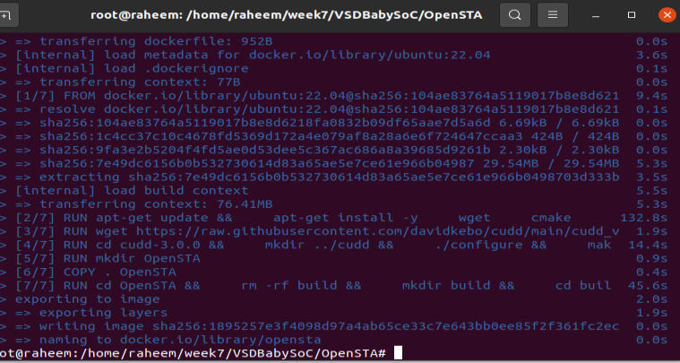
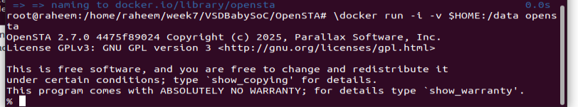

## Comparing Pre-Synthesis and Post-Synthesis Output

To ensure that the synthesis process did not alter the original design behavior, the output from the pre-synthesis simulation was compared with the post-synthesis simulation.

Both simulations were run using GTKWave, and the resulting waveforms were observed.

✅ _The outputs match exactly, confirming that the functionality is preserved across the synthesis flow._

_This validates that the synthesized netlist is functionally equivalent to the RTL design._

## Timing Graphs using openSTA

#### Input Files

- `*.v`  : Gate-level Verilog Netlist  
- `*.lib` : Liberty Timing Libraries  
- `*.sdc` : Synopsys Design Constraints (clocks, delays, false paths)  
- `*.sdf` : Annotated Delay File (optional)  
- `*.spef`: Parasitics (RC extraction)  
- `*.vcd` / `*.saif` : Switching Activity for Power Analysis 

#### Clock Modeling Features

- `Generated Clocks`: Derived from existing clocks  
- `Latency`: Clock propagation delay  
- `Source Latency`: Insertion delay from clock source to input  
- `Uncertainty`: Jitter or skew margins  
- `Propagated vs. Ideal`: Real vs. ideal clock network modeling  
- `Gated Clock Checks`: Verifies clocks that are enabled conditionally  
- `Multi-Frequency Clocks`: Analyzes multiple domains  

#### Exception Paths

Timing exceptions refine analysis for real behavior:

- `set_false_path` — Ignores invalid functional paths  
- `set_multicycle_path` — Allows multiple clock cycles  
- `set_max_delay` / `set_min_delay` — Custom timing limits

#### Delay calculation

- `Integrated Dartu/Menezes/Pileggi RC effective capacitance algorithm`

Models effective capacitance for RC networks to compute realistic gate and net delays. It balances accuracy and runtime using an efficient algorithm developed for timing engines.

- `External delay calculator API`
    
Allows plugging in custom delay calculators for advanced or proprietary models (e.g., layout-aware or temperature-adaptive models). Useful for integrating tool flows beyond standard Liberty data.

#### Timing Analysis and Reporting

OpenSTA provides a rich set of commands for analyzing timing paths, delays, and setup/hold checks:

- `report_checks`  
  Reports timing violations across specified paths using options like `-from`, `-through`, and `-to`. Supports multi-path analysis to any endpoint.

  ```tcl
  report_checks -from [get_pins U1/Q] -to [get_pins U2/D]
  ```
#### Timing Paths 

`What do you mean by Timing Paths?`
* It Refer to the logical paths a signal takes through a digital circuit from its source to its destination, including sequential and combinational elements. STA analyzes timing paths to determine their delay, setup and hold times, and other timing parameters specified in the constraints. Timing paths are categorized into combinatorial and sequential, and the critical path is the longest path in the design with the maximum operating frequency.

#### Timing Path Elements
   
Timing path elements in STA are the start point, where a signal originates, the end point, where it terminates, and the combinational logic elements, such as gates, that the signal passes through. Timing paths are traced to determine the overall delay and timing performance of the digital circuit.

**Start Point**: Is the point where the signal originates or enters the digital circuit. This point is typically an input port of the design, where the signal is first introduced to the circuit.

The start point of a timing path can be either:

- An input port, where data enters the design, or

- The clock pin of a register, where data is launched on a clock edge.

**End Point:** Is the point where the signal terminates or leaves the digital circuit. This point is typically an output port of the design, where the signal is outputted from the circuit.

The end point of a timing path can be either:

- A register's data input pin (D pin), where data is captured by the clock edge, or

- An output port, where data must be available at a specific time.

**Combinational Logic:** Combinational logic elements are the building blocks of a digital circuit and are used to perform logic operations on the signals passing through the circuit. These elements do not store any information, and the output of a combinational logic element is solely determined by the input values at that moment.

The diagram illustrates four distinct timing paths:

Path 1: Input to Register (in2reg)

Path 2: Register to Register (reg2reg)

Path 3: Register to Output (reg2out)

Path 4: Input to Output (in2out)

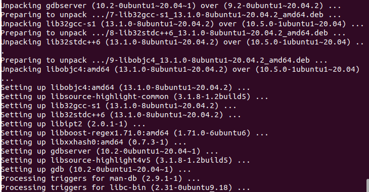

#### Setup and Hold Checks

-> **What is Setup Check?**
* Is the minimum time that the data must be stable before the clock edge, and if this time is not met, it can lead to setup violations, resulting in incorrect data being stored in the sequential element. The setup check is essential to ensure correct timing behavior of a digital circuit and prevent data loss or other timing-related issues.
* The setup time of a flip-flop depends on the technology node, operating conditions, and other factors. The value of the setup time is usually provided in the logic libraries.

-> **What is Hold Check?**
* Is the minimum amount of time that the data must remain stable after the clock edge, and if this time is not met, it can lead to hold violations, resulting in incorrect data being stored in the sequential element. The hold check is necessary to prevent issues such as data corruption, metastability, and other timing-related problems in digital circuits.

#### Slack Calculation 

Setup and hold slack is defined as the difference between data required time and data arrivals time. 

>Setup slack = Data required time - Data arrival time

>Hold slack = Data arrival time - Data required time

-> **What is Data Arrival Time?**
* The time taken by the signal to travel from the start point to the end point of the digital circuit. 

-> **What is Data Required Time?** 
* The time for the clock to traverse through the clock path of the digital circuit. 

-> **What is Slack?** 
* It is difference between the desired arrival times and the actual arrival time for a signal. 
* Positive Slack indicates that the design is meeting the timing and still it can be improved. 
* Zero slack means that the design is critically working at the desired frequency. 
* Negative slack means, design has not achieved the specified timings at the specified frequency.
* Slack has to be positive always and negative slack indicates a violation in timing.

#### Common SDC Constraints

In Static Timing Analysis (STA), **Synopsys Design Constraints (SDC)** are used to define the behavior, environment, and timing requirements of a digital design. These constraints are categorized based on their function and purpose.

**Operating Conditions** are set using the `set_operating_conditions` command, which defines the process-voltage-temperature (PVT) corner used during analysis.

**Wire-Load Models** such as `set_wire_load_mode`, `set_wire_load_model`, and `set_wire_load_selection_group` are used to estimate interconnect capacitance and resistance based on fanout and hierarchy when post-layout parasitics are unavailable.

**Environmental Constraints** define the electrical behavior of I/Os. The `set_drive` and `set_driving_cell` commands model input driving strength or source cell characteristics. Output loads are described using `set_load` or `set_fanout_load`. Additional attributes like `set_input_transition` (input slew) and `set_port_fanout_number` (expected output fanout) further refine environment models.

**Design Rule Constraints** ensure physical design adherence. These include `set_max_capacitance` to limit load, `set_max_fanout` to cap number of loads, and `set_max_transition` to restrict slew for signal integrity and EM/IR compliance.

**Timing Constraints** are the core of STA. `create_clock` defines primary clocks, while `create_generated_clock` handles derived clocks. Clock behavior is further detailed using `set_clock_latency`, `set_clock_transition`, and `set_clock_uncertainty`. Timing analysis can be guided with `set_propagated_clock` to consider actual delays, or `set_disable_timing` to ignore specific paths.

Signal timing is modeled using `set_input_delay` and `set_output_delay`. The `set_input_delay` command specifies when input data arrives relative to the clock edge, crucial for setup/hold timing analysis. The `set_output_delay` command defines the required time by which output signals must be valid, helping STA tools verify that data is launched and captured within acceptable timing windows.

**Timing Exceptions** allow control over non-functional or multi-cycle paths. `set_false_path` removes paths from analysis, `set_max_delay` restricts path delay, and `set_multicycle_path` increases the allowed number of clock cycles for timing paths that do not need single-cycle timing closure.

Lastly, **Power Constraints** help manage dynamic and leakage power budgets using `set_max_dynamic_power` and `set_max_leakage_power`. These are especially useful in power-aware synthesis and verification flows.


| Category              | Commands                                                                 |
|-----------------------|--------------------------------------------------------------------------|
| **Operating Conditions** | `set_operating_conditions`                                                |
| **Wire-load Models**     | `set_wire_load_mode`  <br> `set_wire_load_model` <br> `set_wire_load_selection_group` |
| **Environmental**        | `set_drive` <br> `set_driving_cell` <br> `set_load` <br> `set_fanout_load` <br> `set_input_transition` <br> `set_port_fanout_number` |
| **Design Rules**         | `set_max_capacitance` <br> `set_max_fanout` <br> `set_max_transition`         |
| **Timing**               | `create_clock` <br> `create_generated_clock` <br> `set_clock_latency` <br> `set_clock_transition` <br> `set_disable_timing` <br> `set_propagated_clock` <br> `set_clock_uncertainty` <br> `set_input_delay` <br> `set_output_delay` |
| **Exceptions**           | `set_false_path` <br> `set_max_delay` <br> `set_multicycle_path`              |
| **Power**                | `set_max_dynamic_power` <br> `set_max_leakage_power`                          |

## Installation of OpenSTA

**Note:** Installation instructions are adapted from the official OpenSTA repository:
🔗 https://github.com/parallaxsw/OpenSTA

#### Step 1: Clone the Repository

```bash
git clone https://github.com/parallaxsw/OpenSTA.git
cd OpenSTA
```

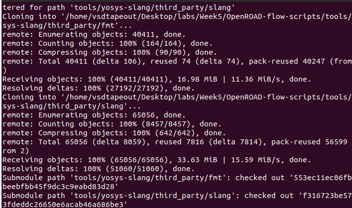

#### Step 2: Build the Docker Image
```bash
\docker build --file Dockerfile.ubuntu22.04 --tag opensta .
```
This builds a Docker image named opensta using the provided Ubuntu 22.04 Dockerfile. All dependencies are installed during this step.

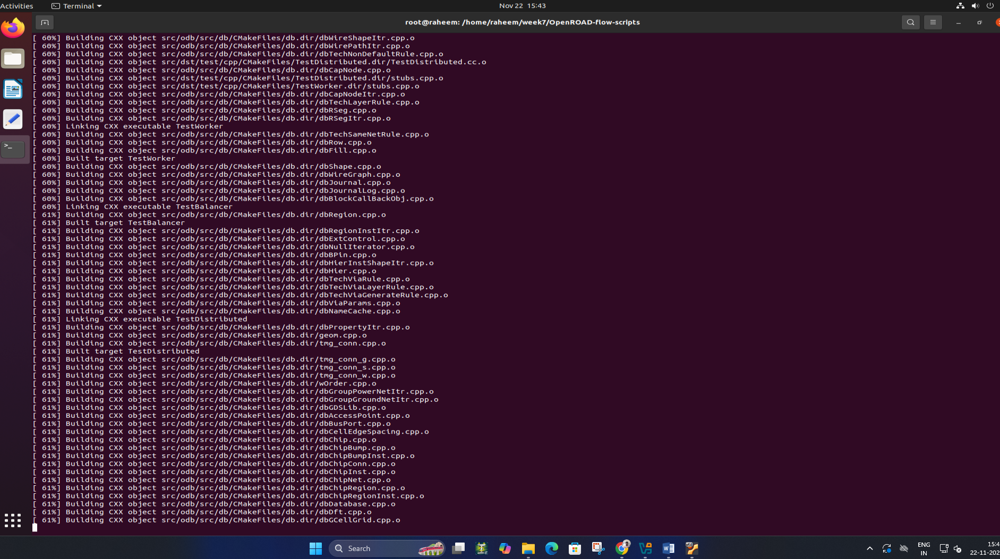

#### Step 3: Run the OpenSTA Container
To run a docker container using the OpenSTA image, use the -v option to docker to mount direcories with data to use and -i to run interactively.
```bash
\docker run -i -v $HOME:/data opensta
```


You now have OpenSTA installed and running inside a Docker container. After successful installation, you will see the % prompt—this indicates that the OpenSTA interactive shell is ready for use.

### VSDBabySoC basic timing analysis

#### Prepare Required Files

To begin static timing analysis on the VSDBabySoC design, you must organize and prepare the required files in specific directories.

```bash
# Create a directory to store Liberty timing libraries
~/Desktop/VLSI/VSDBabySoC/OpenSTA$ mkdir -p examples/timing_libs/
~/Desktop/VLSI/VSDBabySoC/OpenSTA/examples$ ls timing_libs/
avsddac.lib  avsdpll.lib  sky130_fd_sc_hd__tt_025C_1v80.lib
# Create a directory to store synthesized netlist and constraint files
~/Desktop/VLSI/VSDBabySoC/OpenSTA$ mkdir -p examples/BabySoC
~/Desktop/VLSI/VSDBabySoC/OpenSTA/examples$ ls BabySoC/
gcd_sky130hd.sdc vsdbabysoc_synthesis.sdc  vsdbabysoc.synth.v
```
These files include:

- Standard cell library: sky130_fd_sc_hd__tt_025C_1v80.lib

- IP-specific Liberty libraries: avsdpll.lib, avsddac.lib

- Synthesized gate-level netlist: vsdbabysoc.synth.v

- Timing constraints: vsdbabysoc_synthesis.sdc

These files include:

- Standard cell library: sky130_fd_sc_hd__tt_025C_1v80.lib

- IP-specific Liberty libraries: avsdpll.lib, avsddac.lib

- Synthesized gate-level netlist: vsdbabysoc.synth.v

- Timing constraints: vsdbabysoc_synthesis.sdc

Below is the TCL script to run complete min/max timing checks on the SoC:

<details>
<summary><strong>vsdbabysoc_min_max_delays.tcl</strong></summary>
  
```shell
# Load Liberty Libraries (standard cell + IPs)
read_liberty -min /data/Desktop/VLSI/VSDBabySoC/OpenSTA/examples/timing_libs/sky130_fd_sc_hd__tt_025C_1v80.lib
read_liberty -max /data/Desktop/VLSI/VSDBabySoC/OpenSTA/examples/timing_libs/sky130_fd_sc_hd__tt_025C_1v80.lib

read_liberty -min /data/Desktop/VLSI/VSDBabySoC/OpenSTA/examples/timing_libs/avsdpll.lib
read_liberty -max /data/Desktop/VLSI/VSDBabySoC/OpenSTA/examples/timing_libs/avsdpll.lib

read_liberty -min /data/Desktop/VLSI/VSDBabySoC/OpenSTA/examples/timing_libs/avsddac.lib
read_liberty -max /data/Desktop/VLSI/VSDBabySoC/OpenSTA/examples/timing_libs/avsddac.lib

# Read Synthesized Netlist
read_verilog /data/Desktop/VLSI/VSDBabySoC/OpenSTA/examples/BabySoC/vsdbabysoc.synth.v

# Link the Top-Level Design
link_design vsdbabysoc

# Apply SDC Constraints
read_sdc /data/Desktop/VLSI/VSDBabySoC/OpenSTA/examples/BabySoC/vsdbabysoc_synthesis.sdc

# Generate Timing Report
report_checks
```

</details>

| **Line of Code**                                       | **Purpose**                | **Explanation**                                                                                    |
| ------------------------------------------------------ | -------------------------- | -------------------------------------------------------------------------------------------------- |
| `read_liberty -min ...sky130...` & `-max ...sky130...` | Load standard cell library | Loads the **typical PVT corner** for both min (hold) and max (setup) timing analysis.              |
| `read_liberty -min/-max avsdpll.lib`                   | Load PLL IP Liberty        | Includes Liberty timing views of the **PLL IP** used in the design.                                |
| `read_liberty -min/-max avsddac.lib`                   | Load DAC IP Liberty        | Includes Liberty timing views of the **DAC IP** used in the design.                                |
| `read_verilog vsdbabysoc.synth.v`                      | Load synthesized netlist   | Loads the gate-level Verilog netlist of the **VSDBabySoC** design.                                 |
| `link_design vsdbabysoc`                               | Link top-level module      | Links the hierarchy using `vsdbabysoc` as the **top module** for timing analysis.                  |
| `read_sdc vsdbabysoc_synthesis.sdc`                    | Load constraints           | Loads SDC file specifying **clock definitions, input/output delays, and false paths**.             |
| `report_checks`                                        | Run timing analysis        | Generates a default **setup timing report**. Add `-path_delay min_max` to see both hold and setup. |

execute it inside the Docker container:

```shell
\docker run -it -v $HOME:/data opensta /data/VLSI/VSDBabySoC/OpenSTA/examples/BabySoC/vsdbabysoc_min_max_delays.tcl
```
⚠️ **Possible Error Alert**

You may encounter the following error when running the script:

```shell
Warning: /data/Desktop/VLSI/VSDBabySoC/OpenSTA/examples/timing_libs/sky130_fd_sc_hd__tt_025C_1v80.lib line 23, default_fanout_load is 0.0.
Warning: /data/Desktop/VLSI/VSDBabySoC/OpenSTA/examples/timing_libs/sky130_fd_sc_hd__tt_025C_1v80.lib line 1, library sky130_fd_sc_hd__tt_025C_1v80 already exists.
Warning: /data/Desktop/VLSI/VSDBabySoC/OpenSTA/examples/timing_libs/sky130_fd_sc_hd__tt_025C_1v80.lib line 23, default_fanout_load is 0.0.
Error: /data/Desktop/VLSI/VSDBabySoC/OpenSTA/examples/timing_libs/avsdpll.lib line 54, syntax error
```

✅ **Fix:**

This error occurs because Liberty syntax does not support // for single-line comments, and more importantly, the { character appearing after // confuses the Liberty parser. Specifically, check around _line 54 of avsdpll.lib_ and correct any syntax issues such as:

```shell
//pin (GND#2) {
//  direction : input;
//  max_transition : 2.5;
//  capacitance : 0.001;
//}
```
✔️ **Replace with:**
```shell
/*
pin (GND#2) {
  direction : input;
  max_transition : 2.5;
  capacitance : 0.001;
}
*/
```
This should allow OpenSTA to parse the Liberty file without throwing syntax errors.


After fixing the Liberty file comment syntax as shown above, you can rerun the script to perform complete timing analysis for VSDBabySoC:


### VSDBabySoC PVT Corner Analysis (Post-Synthesis Timing)
Static Timing Analysis (STA) is performed across various **PVT (Process-Voltage-Temperature)** corners to ensure the design meets timing requirements under different conditions.

### Critical Timing Corners

**Worst Max Path (Setup-critical) Corners:**
- `ss_LowTemp_LowVolt`
- `ss_HighTemp_LowVolt`  
_These represent the **slowest** operating conditions._

**Worst Min Path (Hold-critical) Corners:**
- `ff_LowTemp_HighVolt`
- `ff_HighTemp_HighVolt`  
_These represent the **fastest** operating conditions._

 **Timing libraries** required for this analysis can be downloaded from:  
🔗 [Skywater PDK - sky130_fd_sc_hd Timing Libraries](https://github.com/efabless/skywater-pdk-libs-sky130_fd_sc_hd/tree/master/timing)

OpenROAD is an open-source, fully automated RTL-to-GDSII flow for digital integrated circuit (IC) design. It supports synthesis, floorplanning, placement, clock tree synthesis, routing, and final layout generation. OpenROAD enables rapid design iterations, making it ideal for academic research and industry prototyping.

### `Steps to Install OpenROAD and Run GUI`

### 1. Clone the OpenROAD Repository

## 🧩 Step 1: Install Prerequisites
Update your system and install core build tools:

```bash
sudo apt update && sudo apt upgrade -y
sudo apt install -y build-essential cmake clang g++ gcc git python3 python3-dev \
  libboost-all-dev libtcl tcl-dev tcllib libreadline-dev zlib1g-dev flex bison \
  swig libpcre3-dev qtbase5-dev liblemon-dev libspdlog-dev libeigen3-dev libffi-dev \
  pkg-config libjson-c-dev libzstd-dev
```
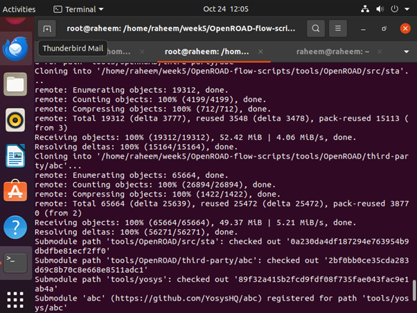
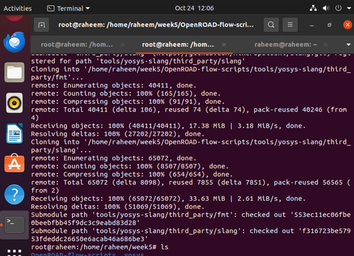

## 📦 Step 2: Clone the Repositories
Install OpenROAD-flow scripts (wrapper for Yosys, OpenROAD, etc.):

```bash
git clone --recursive https://github.com/The-OpenROAD-Project/OpenROAD-flow-scripts.git
cd OpenROAD-flow-scripts
```

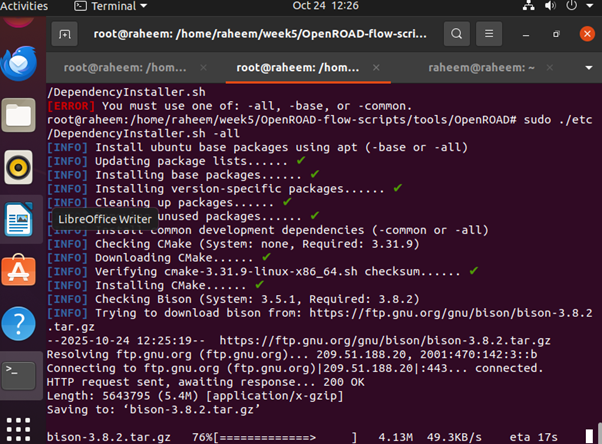


## ⚙️ Step 3: Run the Setup Script
Run the setup installer (this installs all required third-party libraries):

```bash
sudo ./setup.sh
```
This step sets up everything OpenROAD depends on — including Boost, SWIG, Abseil, and more.

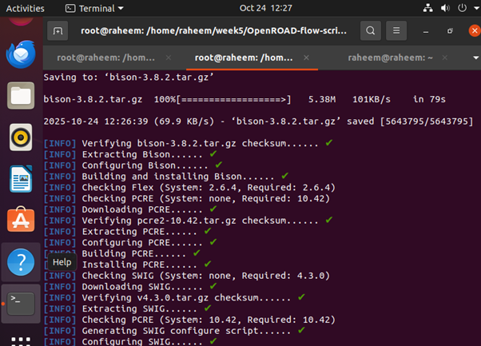


## 🏗️ Step 4: Build OpenROAD Locally
Now build OpenROAD itself using the automated build script:

```bash
./build_openroad.sh --local
```
💡 This step takes about 30–45 minutes depending on cores and RAM.

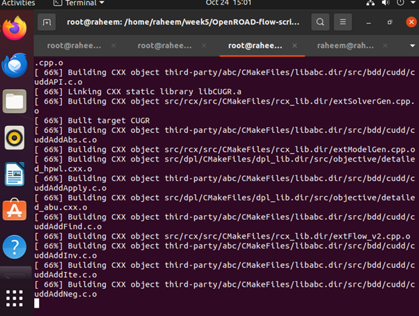

If tests fail to build (common Google Test issue), you can skip them:

```bash
./build_openroad.sh --local --disable-tests
```


## Step 5: Verify Installation

```bash
source ./env.sh
yosys -help  
openroad -help
yosys --version
openroad --version
verilator --version
```

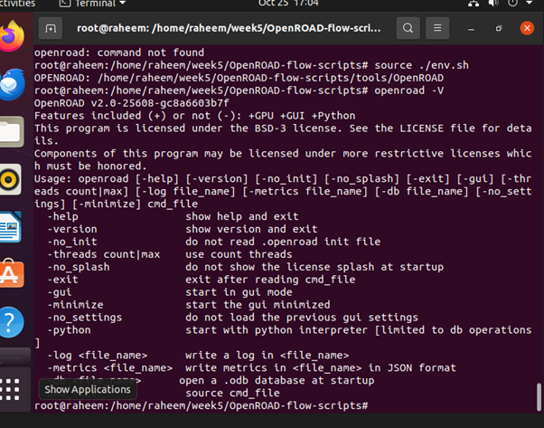


## Step 6: Run the OpenROAD Flow

```bash
cd flow
make
```

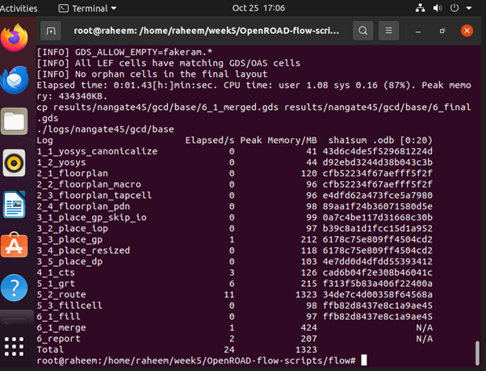


## Step 7. Launch the graphical user interface (GUI) to visualize the final layout

```bash
 make gui_final
```

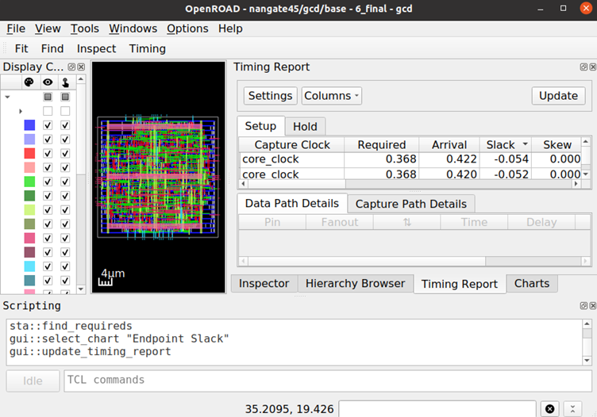


✅ Installation Complete! You can now explore the full RTL-to-GDSII flow using OpenROAD.

### `ORFS Directory Structure and File formats`

OpenROAD-flow-scripts/

```plaintext
├── OpenROAD-flow-scripts             
│   ├── docker           -> It has Docker based installation, run scripts and all saved here
│   ├── docs             -> Documentation for OpenROAD or its flow scripts.  
│   ├── flow             -> Files related to run RTL to GDS flow  
|   ├── jenkins          -> It contains the regression test designed for each build update
│   ├── tools            -> It contains all the required tools to run RTL to GDS flow
│   ├── etc              -> Has the dependency installer script and other things
│   ├── setup_env.sh     -> Its the source file to source all our OpenROAD rules to run the RTL to GDS flow
```


Inside the `flow/` Directory

```plaintext
├── flow           
│   ├── design           -> It has built-in examples from RTL to GDS flow across different technology nodes
│   ├── makefile         -> The automated flow runs through makefile setup
│   ├── platform         -> It has different technology note libraries, lef files, GDS etc 
|   ├── tutorials        
│   ├── util            
│   ├── scripts                 
```
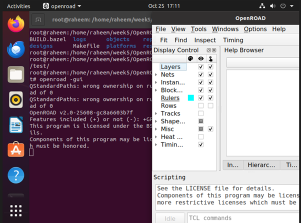
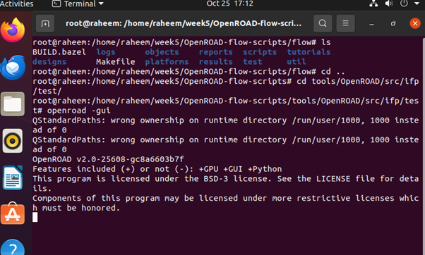
# Floorplan and Placement of VSDBabySoC in OpenROAD

###  `RTL2GDS Flow for VSDBabySoC: Initial Steps`

1. **Create Directories:**
   - Inside `OpenROAD-flow-scripts/flow/designs/sky130hd/`, create a folder named `vsdbabysoc`.
   - Create another folder named `vsdbabysoc` in `OpenROAD-flow-scripts/flow/designs/src/` and place all Verilog files here.

2. **Copy Folders:**
   - From your `VSDBabySoC` folder, copy the following folders into `sky130hd/vsdbabysoc`:
     - **gds:** Contains `avsddac.gds`, `avsdpll.gds`.
     - **include:** Contains `sandpiper.vh`, `sandpiper_gen.vh`, `sp_default.vh`, `sp_verilog.vh`.
     - **lef:** Contains `avsddac.lef`, `avsdpll.lef`.
     - **lib:** Contains `avsddac.lib`, `avsdpll.lib`.

3. **Copy Constraint and Configuration Files:**
   - Copy `vsdbabysoc_synthesis.sdc` into `sky130hd/vsdbabysoc`.
   - Copy `macro.cfg` and `pin_order.cfg` into `sky130hd/vsdbabysoc`.

4. **Create Config File:**
   - Create a `config.mk` file in `sky130hd/vsdbabysoc` with the required configuration details. 

<details> <summary><strong>config.mk</strong></summary>

```
   # Design and Platform Configuration
   export DESIGN_NICKNAME = vsdbabysoc
   export DESIGN_NAME = vsdbabysoc
   export PLATFORM    = sky130hd

  # Design Paths
  export vsdbabysoc_DIR = /home/raheem/Desktop/VLSI/OpenROAD-flow-scripts/flow/designs/sky130hd/$(DESIGN_NICKNAME)

  # Explicitly list Verilog files for synthesis
   export VERILOG_FILES = /home/raheem/Desktop/VLSI/OpenROAD-flow-scripts/flow/designs/src/vsdbabysoc/vsdbabysoc.v \
                         /home/raheem/Desktop/VLSI/OpenROAD-flow-scripts/flow/designs/src/vsdbabysoc/rvmyth.v \
                         /home/raheem/Desktop/VLSI/OpenROAD-flow-scripts/flow/designs/src/vsdbabysoc/clk_gate.v


  # Include Directory for Verilog Header Files
   export VERILOG_INCLUDE_DIRS = $(vsdbabysoc_DIR)/include

  # Constraints File
    export SDC_FILE = $(vsdbabysoc_DIR)/vsdbabysoc_synthesis.sdc

  # Additional GDS Files
    export ADDITIONAL_GDS = $(vsdbabysoc_DIR)/gds/avsddac.gds \
                            $(vsdbabysoc_DIR)/gds/avsdpll.gds

  # Additional LEF Files
   export ADDITIONAL_LEFS = $(vsdbabysoc_DIR)/lef/avsddac.lef \
                            $(vsdbabysoc_DIR)/lef/avsdpll.lef

  # Additional LIB Files
   export ADDITIONAL_LIBS = $(vsdbabysoc_DIR)/lib/avsddac.lib \
                            $(vsdbabysoc_DIR)/lib/avsdpll.lib

 # Pin Order and Macro Placement Configurations
   export FP_PIN_ORDER_CFG = $(vsdbabysoc_DIR)/pin_order.cfg
   export MACRO_PLACEMENT_CFG = $(vsdbabysoc_DIR)/macro.cfg

 # Clock Configuration
   export CLOCK_PORT = CLK
   export CLOCK_NET  = $(CLOCK_PORT)
   export CLOCK_PERIOD = 20.0

# Floorplanning Configuration
  export DIE_AREA   = 0 0 1600 1600
  export CORE_AREA  = 10 10 1590 1590

# Routing Configuration
export GRT_ALLOW_CONGESTION = 1
export GRT_ADJUSTMENT = 0.2
export GLOBAL_ROUTE_ARGS = -allow_congestion -verbose

# Skip the optimization step that is causing the crash.
# (The log showed it was doing 0 repairs anyway).
export SKIP_INCREMENTAL_REPAIR = 1

# Forces standard cells to stay 20 microns away from macros
export MACRO_PLACE_HALO = 20 20

# Increase the spacing (pitch) between Horizontal Power Straps (Met5)
# The default is usually around 180. We increase it to create gaps.
export FP_PDN_HPITCH = 200

# Routing Configuration
export MAX_ROUTING_LAYER = met4

# Placement Configuration
  export PLACE_PINS_ARGS = -exclude left:0-400 -exclude left:1200-1600

# Tuning for Timing and Buffers
  export TNS_END_PERCENT     = 95
  export REMOVE_ABC_BUFFERS  = 1
  export CTS_BUF_DISTANCE    = 300
  export SKIP_GATE_CLONING   = 1

 # Magic Tool Configuration
   export MAGIC_ZEROIZE_ORIGIN = 0
   export MAGIC_EXT_USE_GDS    = 1

```
</details>

This script sets up environment variables and configurations for the design and synthesis of a System-on-Chip (SoC) using the OpenROAD flow. The design is based on the "vsdbabysoc" and targets the "sky130hd" platform.

--------

### `Key Components of config.mk`

#### Design and Platform Configuration
- **DESIGN_NICKNAME & DESIGN_NAME**: Both are set to "vsdbabysoc," serving as the identifier for the design project.
- **PLATFORM**: Specifies the technology platform as "sky130hd," indicating the process node and design rules to be used.

#### Design Paths
- **vsdbabysoc_DIR**: Defines the directory path for the design files as `/home/raheem/Desktop/VLSI/OpenROAD-flow-scripts/flow/designs/sky130hd/vsdbabysoc`. This path is constructed using the DESIGN_NICKNAME variable, ensuring consistency and easy access to design resources.

#### Verilog Files for Synthesis
- **VERILOG_FILES**: Lists the Verilog source files required for synthesis:
  - `/home/raheem/Desktop/VLSI/OpenROAD-flow-scripts/flow/designs/src/vsdbabysoc/vsdbabysoc.v`: The main Verilog file for the SoC design.
  - `/home/raheem/Desktop/VLSI/OpenROAD-flow-scripts/flow/designs/src/vsdbabysoc/rvmyth.v`: A module within the design, possibly a RISC-V core or related component.
  - `/home/raheem/Desktop/VLSI/OpenROAD-flow-scripts/flow/designs/src/vsdbabysoc/clk_gate.v`: A module for clock gating, used to manage power consumption by controlling clock signals.

#### Verilog Header Files
- **VERILOG_INCLUDE_DIRS**: Specifies the directory for Verilog header files as `/home/raheem/Desktop/VLSI/OpenROAD-flow-scripts/flow/designs/sky130hd/vsdbabysoc/include`.

#### Constraints and Additional Files
- **SDC_FILE**: Points to the constraints file for synthesis located at `/home/raheem/Desktop/VLSI/OpenROAD-flow-scripts/flow/designs/sky130hd/vsdbabysoc/vsdbabysoc_synthesis.sdc`.
- **ADDITIONAL_GDS**: Lists additional GDS files required for the design:
  - `/home/raheem/Desktop/VLSI/OpenROAD-flow-scripts/flow/designs/sky130hd/vsdbabysoc/gds/avsddac.gds`
  - `/home/raheem/Desktop/VLSI/OpenROAD-flow-scripts/flow/designs/sky130hd/vsdbabysoc/gds/avsdpll.gds`
- **ADDITIONAL_LEFS**: Lists additional LEF files:
  - `/home/raheem/Desktop/VLSI/OpenROAD-flow-scripts/flow/designs/sky130hd/vsdbabysoc/lef/avsddac.lef`
  - `/home/raheem/Desktop/VLSI/OpenROAD-flow-scripts/flow/designs/sky130hd/vsdbabysoc/lef/avsdpll.lef`
- **ADDITIONAL_LIBS**: Lists additional LIB files:
  - `/home/raheem/Desktop/VLSI/OpenROAD-flow-scripts/flow/designs/sky130hd/vsdbabysoc/lib/avsddac.lib`
  - `/home/raheem/Desktop/VLSI/OpenROAD-flow-scripts/flow/designs/sky130hd/vsdbabysoc/lib/avsdpll.lib`

#### Pin Order and Macro Placement
- **FP_PIN_ORDER_CFG**: Configuration file for pin order located at `/home/raheem/Desktop/VLSI/OpenROAD-flow-scripts/flow/designs/sky130hd/vsdbabysoc/pin_order.cfg`.
- **MACRO_PLACEMENT_CFG**: Configuration file for macro placement located at `/home/raheem/Desktop/VLSI/OpenROAD-flow-scripts/flow/designs/sky130hd/vsdbabysoc/macro.cfg`.

#### Clock Configuration
- **CLOCK_PORT & CLOCK_NET**: Defines the clock port and net as `CLK`.
- **CLOCK_PERIOD**: Sets the clock period to `20.0` units.

#### Floorplanning Configuration
- **DIE_AREA**: Specifies the die area dimensions as `0 0 1600 1600`.
- **CORE_AREA**: Specifies the core area dimensions as `20 20 1590 1590`.

#### Placement Configuration
- **PLACE_PINS_ARGS**: Arguments for pin placement, excluding certain areas on the die:
  - `-exclude left:0-600`
  - `-exclude left:1000-1600`
  - `-exclude right:*`
  - `-exclude top:*`
  - `-exclude bottom:*`

#### Timing and Buffer Tuning
- **TNS_END_PERCENT**: Sets the target negative slack end percentage to `100`.
- **REMOVE_ABC_BUFFERS**: Enables removal of ABC buffers, set to `1`.
- **CTS_BUF_DISTANCE**: Sets the buffer distance for clock tree synthesis to `600`.
- **SKIP_GATE_CLONING**: Skips gate cloning during synthesis, set to `1`.

#### Magic Tool Configuration
- **MAGIC_ZEROIZE_ORIGIN**: Configuration for zeroizing the origin, set to `0`.
- **MAGIC_EXT_USE_GDS**: Configuration for using GDS files, set to `1`.

This setup script is crucial for defining the environment and parameters needed for successful synthesis and layout of the "vsdbabysoc" design on the "sky130hd" platform, ensuring that all necessary files and configurations are in place for the design flow.

# Macro Configuration File Documentation

The `macro.cfg` file defines the placement coordinates and orientation for hardware macros in a chip design layout, typically used in VLSI/ASIC design flows.

## File Format

Each line in the configuration file follows this syntax pattern:

```
<macro_name> <x_coordinate> <y_coordinate> <orientation>
```

## Configuration Breakdown

### PLL Macro
```
pll 200 950 N
```

- **Macro Name**: `pll` (Phase-Locked Loop)
- **X Coordinate**: 200 (horizontal placement position)
- **Y Coordinate**: 950 (vertical placement position)
- **Orientation**: `N` (North - standard upright orientation)

The PLL is a critical clock generation and management circuit positioned at coordinates (200, 950) with standard North orientation.

### DAC Macro
```
dac 150 250 MY
```

- **Macro Name**: `dac` (Digital-to-Analog Converter)
- **X Coordinate**: 150 (horizontal placement position)
- **Y Coordinate**: 250 (vertical placement position)
- **Orientation**: `MY` (Mirror Y - flipped along the Y-axis)

The DAC macro handles digital-to-analog conversion and is placed at coordinates (150, 250) with Y-axis mirroring applied.

## Orientation Values

Common orientation flags include:
- **N**: North (0° rotation, standard)
- **S**: South (180° rotation)
- **E**: East (90° clockwise)
- **W**: West (90° counter-clockwise)
- **MY**: Mirror Y-axis
- **MX**: Mirror X-axis

## Usage

This configuration file is typically consumed by place-and-route tools during the physical design phase to ensure proper macro placement and avoid routing congestion.

## Edit global_route.tcl

The Fix: Comment Out the "Extra" Optimizations
Since we cannot disable this step via config.mk, we must comment it out in the Tcl script. You don't need Power Recovery for this design anyway.

Step 1: Open the Script Open the file global_route.tcl in your text editor. (It is likely located at flow/scripts/global_route.tcl or inside your scripts folder).

Step 2: Comment Out Power Recovery Find the section that looks like this (around line 100-110) and add # to the start of every line to disable it:

```Tcl
# ----------------- COMMENT THIS BLOCK OUT -----------------
# log_cmd global_route -start_incremental
# recover_power_helper
# # Route the modified nets by rsz journal restore
# log_cmd global_route -end_incremental {*}$res_aware \
#   -congestion_report_file $::env(REPORTS_DIR)/congestion_post_recover_power.rpt
# -----------------------------------------------------------
```

<details> <summary><strong>global_route.tcl</strong></summary>
   
      utl::set_metrics_stage "globalroute__{}"
      source $::env(SCRIPTS_DIR)/load.tcl
      erase_non_stage_variables grt
      load_design 4_cts.odb 4_cts.sdc
      
      # This proc is here to allow us to use 'return' to return early from this
      # file which is sourced
      proc global_route_helper { } {
        source_env_var_if_exists PRE_GLOBAL_ROUTE_TCL
   
     set res_aware ""
     append_env_var res_aware ENABLE_RESISTANCE_AWARE -resistance_aware 0
   
     proc do_global_route { res_aware } {
       set all_args [concat [list \
         -congestion_report_file $::global_route_congestion_report] \
         $::env(GLOBAL_ROUTE_ARGS) {*}$res_aware]
   
       log_cmd global_route {*}$all_args
     }
     set additional_args ""
     append_env_var additional_args dbProcessNode -db_process_node 1
     append_env_var additional_args VIA_IN_PIN_MIN_LAYER -via_in_pin_bottom_layer 1
     append_env_var additional_args VIA_IN_PIN_MAX_LAYER -via_in_pin_top_layer 1
   
     pin_access {*}$additional_args
   
     set result [catch { do_global_route $res_aware } errMsg]
   
     if { $result != 0 } {
       if { !$::env(GENERATE_ARTIFACTS_ON_FAILURE) } {
         write_db $::env(RESULTS_DIR)/5_1_grt-failed.odb
         error $errMsg
       }
       write_sdc -no_timestamp $::env(RESULTS_DIR)/5_1_grt.sdc
       write_db $::env(RESULTS_DIR)/5_1_grt.odb
       return
     }
   
     set_placement_padding -global \
       -left $::env(CELL_PAD_IN_SITES_DETAIL_PLACEMENT) \
       -right $::env(CELL_PAD_IN_SITES_DETAIL_PLACEMENT)
   
     set_propagated_clock [all_clocks]
     estimate_parasitics -global_routing
   
     if { [env_var_exists_and_non_empty DONT_USE_CELLS] } {
       set_dont_use $::env(DONT_USE_CELLS)
     }
   
     if { !$::env(SKIP_INCREMENTAL_REPAIR) } {
       if { $::env(DETAILED_METRICS) } {
         report_metrics 5 "global route pre repair design"
       }

    # Repair design using global route parasitics
    repair_design_helper
    if { $::env(DETAILED_METRICS) } {
      report_metrics 5 "global route post repair design"
    }

    # Running DPL to fix overlapped instances
    # Run to get modified net by DPL
    log_cmd global_route -start_incremental
    log_cmd detailed_placement
    # Route only the modified net by DPL
    log_cmd global_route -end_incremental {*}$res_aware \
      -congestion_report_file $::env(REPORTS_DIR)/congestion_post_repair_design.rpt

    # Repair timing using global route parasitics
    puts "Repair setup and hold violations..."
    estimate_parasitics -global_routing

    repair_timing_helper

    if { $::env(DETAILED_METRICS) } {
      report_metrics 5 "global route post repair timing"
    }

    # Running DPL to fix overlapped instances
    # Run to get modified net by DPL
    log_cmd global_route -start_incremental
    log_cmd detailed_placement
    # Route only the modified net by DPL
    log_cmd global_route -end_incremental {*}$res_aware \
      -congestion_report_file $::env(REPORTS_DIR)/congestion_post_repair_timing.rpt
     }


      #  log_cmd global_route -start_incremental
      #  recover_power_helper
     # Route the modified nets by rsz journal restore
      #  log_cmd global_route -end_incremental {*}$res_aware \
    -congestion_report_file $::env(REPORTS_DIR)/congestion_post_recover_power.rpt

     if {
       !$::env(SKIP_ANTENNA_REPAIR) &&
       [env_var_exists_and_non_empty MAX_REPAIR_ANTENNAS_ITER_GRT]
     } {
    puts "Repair antennas..."
    repair_antennas -iterations $::env(MAX_REPAIR_ANTENNAS_ITER_GRT)
    check_placement -verbose
    check_antennas -report_file $::env(REPORTS_DIR)/grt_antennas.log
     }

     puts "Estimate parasitics..."
     estimate_parasitics -global_routing

     report_metrics 5 "global route"

     # Write SDC to results with updated clock periods that are just failing.
     # Use make target update_sdc_clock to install the updated sdc.
     source [file join $::env(SCRIPTS_DIR) "write_ref_sdc.tcl"]

     write_guides $::env(RESULTS_DIR)/route.guide
     write_db $::env(RESULTS_DIR)/5_1_grt.odb
     write_sdc -no_timestamp $::env(RESULTS_DIR)/5_1_grt.sdc
      }

      global_route_helper
</details>

### Another Fix thanks to the [@BitopanBaishya](https://github.com/BitopanBaishya)

He modified the macro_place_util.tcl file so that it reads the macro.cfg as follows:

He replaced
```
log_cmd rtl_macro_placer {*}$all_args
```
with
```
  # Manual macro placement using macro.cfg
if { [env_var_exists_and_non_empty MACRO_PLACEMENT_CFG] } {

set fp [open $::env(MACRO_PLACEMENT_CFG) r]
while {[gets $fp line] >= 0} {
# skip empty and comment lines
if {[regexp {^\s*$} $line]} continue
if {[regexp {^#} $line]} continue

# Parse: <macro> <x> <y> <orient>
scan $line "%s %f %f %s" macro x y orient

puts "Placing macro $macro at ($x, $y) orient $orient"
place_macro -macro_name $macro -location "$x $y" -orientation $orient
}
close $fp
}
```

### `File Structure After Setup`

```shell
raheem@raheem:~/Desktop/VLSI/OpenROAD-flow-scripts/flow/designs/src/vsdbabysoc$ ls -ltrh
total 3.1M
-rw-rw-r-- 1 raheem raheem  590 Nov 13 20:54 vsdbabysoc.v
-rwxrwxr-x 1 raheem raheem 1.3K Nov 13 20:54 testbench.v
-rw-rw-r-- 1 raheem raheem  603 Nov 13 20:54 testbench.rvmyth.post-routing.v
-rw-rw-r-- 1 raheem raheem 1.7K Nov 13 20:54 clk_gate.v
-rw-rw-r-- 1 raheem raheem  947 Nov 13 20:54 avsdpll.v
-rw-rw-r-- 1 raheem raheem 1.1K Nov 13 20:54 avsddac.v
-rw-rw-r-- 1 raheem raheem  17K Nov 13 21:00 rvmyth.v
-rw-rw-r-- 1 raheem raheem  19K Nov 13 21:00 rvmyth_gen.v
-rw-rw-r-- 1 raheem raheem  50K Nov 13 21:21 primitives.v -> /home/raheem/Desktop/VLSI/VLSI/sky130RTLDesignAndSynthesisWorkshop/my_lib/verilog_model/primitives.v
-rw-rw-r-- 1 raheem raheem 749K Nov 13 21:22 vsdbabysoc.synth.v
-rw-rw-r-- 1 raheem raheem 2.3M Nov 13 21:29 sky130_fd_sc_hd.v
```

```shell
raheem@raheem:~/Desktop/VLSI/OpenROAD-flow-scripts/flow/designs/sky130hd/vsdbabysoc$ ls -ltrh
total 32K
-rw-rw-r-- 1 raheem raheem   73 Nov 13 20:54 vsdbabysoc_synthesis.sdc
-rw-rw-r-- 1 raheem raheem   62 Nov 13 20:54 pin_order.cfg -> /home/raheem/Desktop/VLSI/VSDBabySoC/src/layout_conf/vsdbabysoc/pin_order.cfg
-rw-rw-r-- 1 raheem raheem   28 Nov 13 20:54 macro.cfg -> /home/raheem/Desktop/VLSI/VSDBabySoC/src/layout_conf/vsdbabysoc/macro.cfg
drwxrwxr-x 2 raheem raheem 4.0K Nov 13 20:54 lef
drwxrwxr-x 2 raheem raheem 4.0K Nov 13 20:54 include
drwxrwxr-x 2 raheem raheem 4.0K Nov 13 20:54 gds
-rw-rw-r-- 1 raheem raheem 2.2K Nov 15 18:45 config.mk
drwxrwxr-x 2 raheem raheem 4.0K Nov 15 18:59 lib

```

#### Now go to terminal and run the following commands:

```shell
# Navigate to the OpenROAD flow scripts directory
cd OpenROAD-flow-scripts
# Source the environment setup script
source env.sh
# Change to the flow directory
cd flow
```


----
 
### `Run Synthesis`

```shell
# Ensure you are in the 'flow' directory before running the synthesis command
make DESIGN_CONFIG=./designs/sky130hd/vsdbabysoc/config.mk clean_all
make DESIGN_CONFIG=./designs/sky130hd/vsdbabysoc/config.mk synth
```

This command runs the synthesis process using the specified design configuration file `config.mk` for the `vsdbabysoc` design on the `sky130hd` platform.


#### Synthesis netlist

```shell
~/OpenROAD-flow-scripts/flow$ gvim results/sky130hd/vsdbabysoc/base/1_1_yosys.v
```
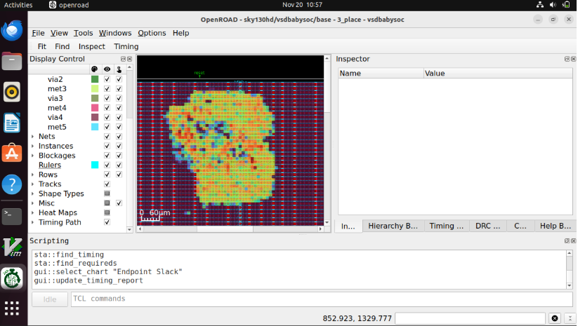


#### Synthesis Stats

```shell
~/OpenROAD-flow-scripts/flow$ gvim reports/sky130hd/vsdbabysoc/base/synth_stat.txt
```


<details> <summary><strong>synth_stat.txt</strong></summary>

```

20. Printing statistics.

=== vsdbabysoc ===

        +----------Local Count, excluding submodules.
        |        +-Local Area, excluding submodules.
        |        | 
     6715        - wires
     6715        - wire bits
     1285        - public wires
     1285        - public wire bits
        7        - ports
        7        - port bits
     6605 5.29E+04 cells
        1        -   avsddac
        1        -   avsdpll
        1   11.261   sky130_fd_sc_hd__a2111o_1
        6    52.55   sky130_fd_sc_hd__a2111oi_0
        8   70.067   sky130_fd_sc_hd__a211o_1
       26  195.187   sky130_fd_sc_hd__a211oi_1
       17  127.622   sky130_fd_sc_hd__a21boi_0
       31  232.723   sky130_fd_sc_hd__a21o_1
      884 4.42E+03   sky130_fd_sc_hd__a21oi_1
        7   61.309   sky130_fd_sc_hd__a21oi_2
       15  150.144   sky130_fd_sc_hd__a221o_1
       37  324.061   sky130_fd_sc_hd__a221oi_1
       24  210.202   sky130_fd_sc_hd__a22o_1
      222 1.67E+03   sky130_fd_sc_hd__a22oi_1
        1    21.27   sky130_fd_sc_hd__a22oi_4
        1   11.261   sky130_fd_sc_hd__a2bb2o_2
        4   35.034   sky130_fd_sc_hd__a2bb2oi_1
        2   20.019   sky130_fd_sc_hd__a311o_1
       15  131.376   sky130_fd_sc_hd__a311oi_1
        8   70.067   sky130_fd_sc_hd__a31o_2
       53  331.568   sky130_fd_sc_hd__a31oi_1
        1    10.01   sky130_fd_sc_hd__a32o_1
        3   26.275   sky130_fd_sc_hd__a32oi_1
        3   26.275   sky130_fd_sc_hd__a41oi_1
        2   12.512   sky130_fd_sc_hd__and2_0
       10    62.56   sky130_fd_sc_hd__and2_1
       14   87.584   sky130_fd_sc_hd__and3_1
       34  127.622   sky130_fd_sc_hd__buf_1
        9   45.043   sky130_fd_sc_hd__buf_2
        1    7.507   sky130_fd_sc_hd__buf_4
        3   33.782   sky130_fd_sc_hd__buf_6
      548 2.06E+03   sky130_fd_sc_hd__clkbuf_1
        4   15.014   sky130_fd_sc_hd__clkinv_1
        1    3.754   sky130_fd_sc_hd__conb_1
     1144 2.29E+04   sky130_fd_sc_hd__dfxtp_1
        4   80.077   sky130_fd_sc_hd__fa_1
      100   1251.2   sky130_fd_sc_hd__ha_1
      104  390.374   sky130_fd_sc_hd__inv_1
       56  630.605   sky130_fd_sc_hd__mux2_2
       92  920.883   sky130_fd_sc_hd__mux2i_1
        1   22.522   sky130_fd_sc_hd__mux2i_4
       69  1553.99   sky130_fd_sc_hd__mux4_2
     1461  5484.01   sky130_fd_sc_hd__nand2_1
       28  175.168   sky130_fd_sc_hd__nand2b_1
      213 1.07E+03   sky130_fd_sc_hd__nand3_1
       40  300.288   sky130_fd_sc_hd__nand3b_1
       70   437.92   sky130_fd_sc_hd__nand4_1
        2   17.517   sky130_fd_sc_hd__nand4b_1
      284 1.07E+03   sky130_fd_sc_hd__nor2_1
       52  325.312   sky130_fd_sc_hd__nor2b_1
       74  370.355   sky130_fd_sc_hd__nor3_1
        9   67.565   sky130_fd_sc_hd__nor3b_1
        1   12.512   sky130_fd_sc_hd__nor3b_2
       25    156.4   sky130_fd_sc_hd__nor4_1
        1    8.758   sky130_fd_sc_hd__nor4b_1
        1   11.261   sky130_fd_sc_hd__o2111a_1
        8   70.067   sky130_fd_sc_hd__o2111ai_1
        3   30.029   sky130_fd_sc_hd__o211a_1
       51  382.867   sky130_fd_sc_hd__o211ai_1
       30  225.216   sky130_fd_sc_hd__o21a_1
      397 1.99E+03   sky130_fd_sc_hd__o21ai_0
        8   40.038   sky130_fd_sc_hd__o21ai_1
       10   75.072   sky130_fd_sc_hd__o21bai_1
       27  236.477   sky130_fd_sc_hd__o221ai_1
       36  315.302   sky130_fd_sc_hd__o22a_1
       31  193.936   sky130_fd_sc_hd__o22ai_1
        2   17.517   sky130_fd_sc_hd__o2bb2ai_1
        1    10.01   sky130_fd_sc_hd__o311a_1
        6    52.55   sky130_fd_sc_hd__o311ai_0
        5   43.792   sky130_fd_sc_hd__o31a_1
       34  255.245   sky130_fd_sc_hd__o31ai_1
        1   12.512   sky130_fd_sc_hd__o31ai_2
        2   20.019   sky130_fd_sc_hd__o32a_1
        4   35.034   sky130_fd_sc_hd__o32ai_1
        1   11.261   sky130_fd_sc_hd__o41a_1
        5   43.792   sky130_fd_sc_hd__o41ai_1
        2   12.512   sky130_fd_sc_hd__or2_0
        1    6.256   sky130_fd_sc_hd__or2_1
        8   50.048   sky130_fd_sc_hd__or2_2
       28  175.168   sky130_fd_sc_hd__or3_1
        1    8.758   sky130_fd_sc_hd__or3b_1
        2   17.517   sky130_fd_sc_hd__or3b_2
        4   30.029   sky130_fd_sc_hd__or4_1
       47  411.645   sky130_fd_sc_hd__xnor2_1
       22  192.685   sky130_fd_sc_hd__xor2_1

   Area for cell type \avsdpll is unknown!
   Area for cell type \avsddac is unknown!

   Chip area for module '\vsdbabysoc': 52874.460800
     of which used for sequential elements: 22901.964800 (43.31%)

```
</details>

----------

### `Run Floorplan`

```shell
make DESIGN_CONFIG=./designs/sky130hd/vsdbabysoc/config.mk floorplan
```
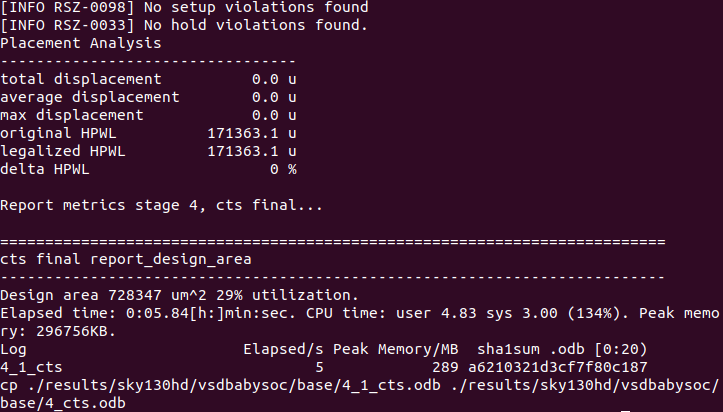
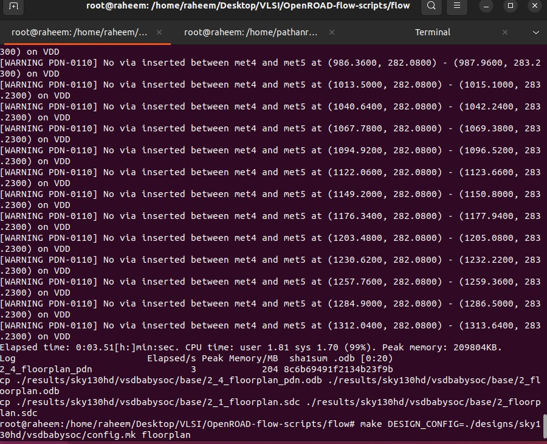

This command initiates the floorplanning process for the `vsdbabysoc` design using the specified configuration file `config.mk` on the `sky130hd` platform.

#### Floorplan Error and Fix

❗**Note:** You may encounter the following error:

```shell
[ERROR STA-0164] .../vsdbabysoc/lib/avsdpll.lib line 54, syntax error
Error: floorplan.tcl, 4 STA-0164
```

**Fix:**
This error is caused by commented block structures in your Liberty file avsdpll.lib. OpenROAD’s parser does not tolerate partially commented blocks like:

```shell
//pin (GND#2) {
//  direction : input;
//  max_transition : 2.5;
//  capacitance : 0.001;
//}
```

✅ To fix it, simply delete the entire commented block starting at line 54:

After saving the changes, re-run the floorplan step and the flow should proceed without syntax errors. 

#### Floorplan Result (GUI)

```shell
make DESIGN_CONFIG=./designs/sky130hd/vsdbabysoc/config.mk gui_floorplan
```


------

### `Run Placement`

```shell
make DESIGN_CONFIG=./designs/sky130hd/vsdbabysoc/config.mk place
```
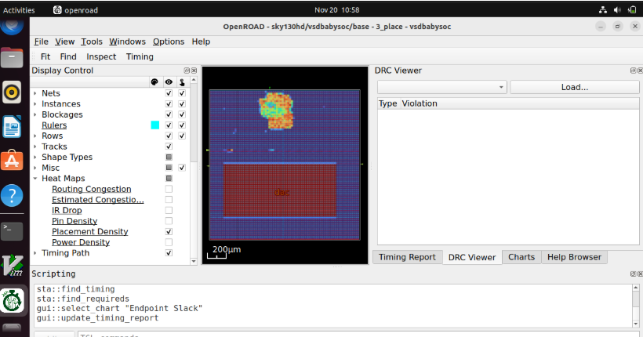
This command executes the placement process for the `vsdbabysoc` design, utilizing the configuration file `config.mk` on the `sky130hd` platform to arrange the circuit components optimally within the defined floorplan.


#### Placement Result (GUI)

```shell
make DESIGN_CONFIG=./designs/sky130hd/vsdbabysoc/config.mk gui_place
```


To view the Placement Density heatmap in OpenROAD:

Go to **Tools → Heat maps → Placement Density** → **✓ Show numbers**


### `run cts`

```shell
make DESIGN_CONFIG=./designs/sky130hd/vsdbabysoc/config.mk cts
```

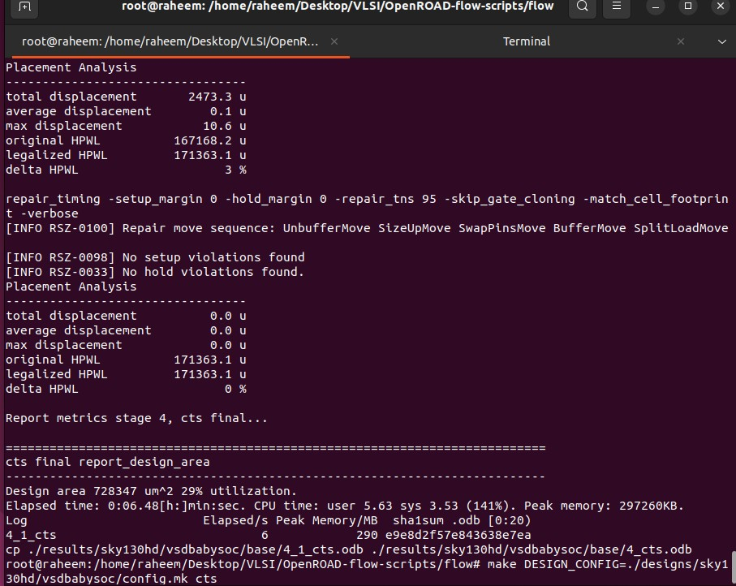

**CTS Result (GUI)**

```shell
make DESIGN_CONFIG=./designs/sky130hd/vsdbabysoc/config.mk gui_cts
```

This image shows the Clock Tree Synthesis (CTS) stage, highlighting a placed clock buffer (clkbuf_leaf_209_CLK) with its properties displayed in the Inspector, including position, orientation, and connectivity details.

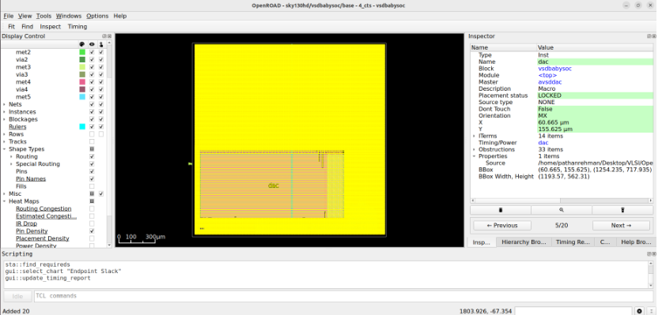


This image shows the **Clock Tree Viewer** after CTS, illustrating the clock buffer distribution on the layout and a histogram of clock insertion delays, indicating balanced clock skew across the sinks.


This image shows the **Setup Timing Report**, presenting a list of timing paths with key metrics such as:

- **Required Time**
- **Arrival Time**
- **Slack**
- **Skew**
- **Logic Delay**
- **Logic Depth**
- **Fanout**

All paths have **positive slack**, confirming that the design meets **setup timing requirements**.


This image displays the **Hold Timing Report**, showing timing paths with details such as:

- **Required Time**
- **Arrival Time**
- **Slack**
- **Skew**
- **Logic Delay**
- **Fanout**

All paths listed have **positive slack**, indicating that the design meets **hold timing requirements** and is free from hold violations.

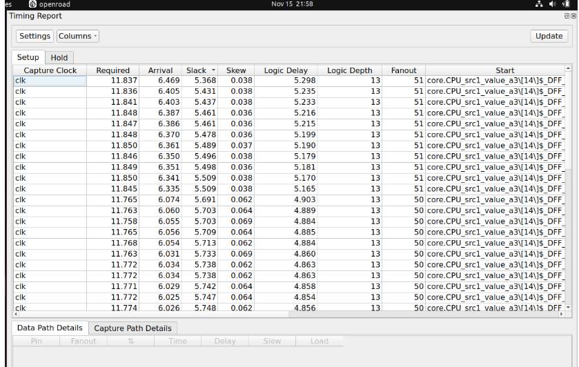


This image shows the **Setup Slack Histogram** after CTS. The histogram represents the distribution of endpoint slack values, all of which are positive, indicating that there are no setup timing violations.

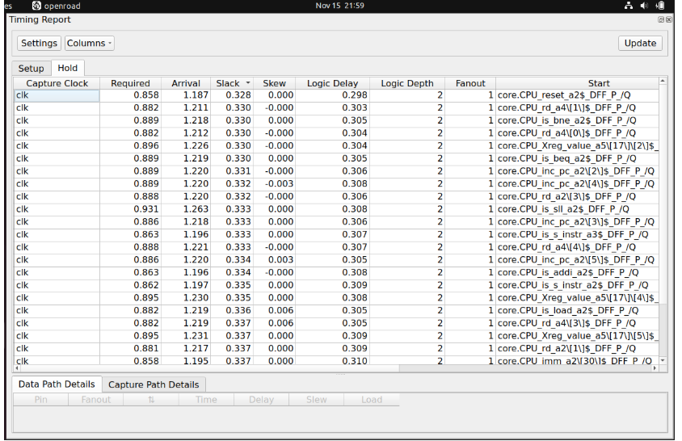


This image shows the **Hold Slack Histogram** after CTS. The histogram represents the distribution of hold slack values for all endpoints. All values are positive, confirming that the design meets hold timing requirements without any violations.

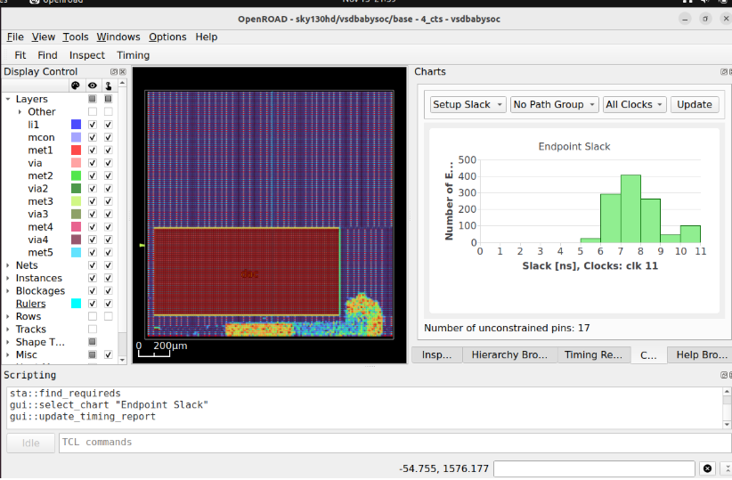


Zoomed-in view of the design after CTS, showing inserted clock buffers and routing connections.

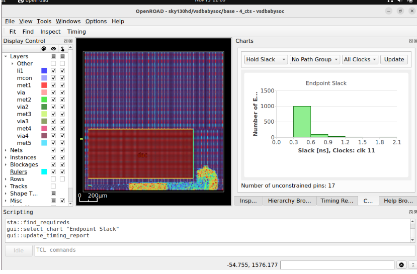


**CTS final report:**

```shell
gvim /home/raheem/Desktop/VLSI/OpenROAD-flow-scripts/flow/reports/sky130hd/vsdbabysoc/base/4_cts_final.rpt
```

<details> <summary><strong>4_cts_final.rpt</strong></summary>

```


==========================================================================
cts final report_tns
--------------------------------------------------------------------------
tns max 0.00

==========================================================================
cts final report_wns
--------------------------------------------------------------------------
wns max 0.00

==========================================================================
cts final report_worst_slack
--------------------------------------------------------------------------
worst slack max 6.31

==========================================================================
cts final report_clock_min_period
--------------------------------------------------------------------------
clk period_min = 4.69 fmax = 213.35

==========================================================================
cts final report_clock_skew
--------------------------------------------------------------------------
Clock clk
   0.95 source latency core.CPU_result_a4[2]$_DFF_P_/CLK ^
  -0.83 target latency core.CPU_Dmem_value_a5[4][8]$_SDFFE_PP0P_/CLK ^
   0.00 CRPR
--------------
   0.12 setup skew


==========================================================================
cts final report_checks -path_delay min
--------------------------------------------------------------------------
Startpoint: core.CPU_reset_a2$_DFF_P_
            (rising edge-triggered flip-flop clocked by clk)
Endpoint: core.CPU_reset_a3$_DFF_P_
          (rising edge-triggered flip-flop clocked by clk)
Path Group: clk
Path Type: min

Fanout     Cap    Slew   Delay    Time   Description
-----------------------------------------------------------------------------
                          0.00    0.00   clock clk (rise edge)
                          0.00    0.00   clock source latency
     1    0.15    0.00    0.00    0.00 ^ pll/CLK (avsdpll)
                                         CLK (net)
                  0.01    0.01    0.01 ^ clkbuf_0_CLK/A (sky130_fd_sc_hd__clkbuf_16)
     4    0.18    0.19    0.23    0.23 ^ clkbuf_0_CLK/X (sky130_fd_sc_hd__clkbuf_16)
                                         clknet_0_CLK (net)
                  0.19    0.00    0.24 ^ clkbuf_2_2_0_CLK/A (sky130_fd_sc_hd__clkbuf_16)
     4    0.11    0.12    0.24    0.48 ^ clkbuf_2_2_0_CLK/X (sky130_fd_sc_hd__clkbuf_16)
                                         clknet_2_2_0_CLK (net)
                  0.12    0.00    0.48 ^ clkbuf_4_9__f_CLK/A (sky130_fd_sc_hd__clkbuf_16)
     7    0.09    0.11    0.21    0.69 ^ clkbuf_4_9__f_CLK/X (sky130_fd_sc_hd__clkbuf_16)
                                         clknet_4_9__leaf_CLK (net)
                  0.11    0.00    0.69 ^ clkbuf_leaf_13_CLK/A (sky130_fd_sc_hd__clkbuf_16)
     9    0.03    0.05    0.16    0.85 ^ clkbuf_leaf_13_CLK/X (sky130_fd_sc_hd__clkbuf_16)
                                         clknet_leaf_13_CLK (net)
                  0.05    0.00    0.85 ^ core.CPU_reset_a2$_DFF_P_/CLK (sky130_fd_sc_hd__dfxtp_1)
     1    0.00    0.02    0.29    1.14 v core.CPU_reset_a2$_DFF_P_/Q (sky130_fd_sc_hd__dfxtp_1)
                                         core.CPU_reset_a2 (net)
                  0.02    0.00    1.14 v core.CPU_reset_a3$_DFF_P_/D (sky130_fd_sc_hd__dfxtp_4)
                                  1.14   data arrival time

                          0.00    0.00   clock clk (rise edge)
                          0.00    0.00   clock source latency
     1    0.15    0.00    0.00    0.00 ^ pll/CLK (avsdpll)
                                         CLK (net)
                  0.01    0.01    0.01 ^ clkbuf_0_CLK/A (sky130_fd_sc_hd__clkbuf_16)
     4    0.18    0.19    0.23    0.23 ^ clkbuf_0_CLK/X (sky130_fd_sc_hd__clkbuf_16)
                                         clknet_0_CLK (net)
                  0.19    0.00    0.24 ^ clkbuf_2_2_0_CLK/A (sky130_fd_sc_hd__clkbuf_16)
     4    0.11    0.12    0.24    0.48 ^ clkbuf_2_2_0_CLK/X (sky130_fd_sc_hd__clkbuf_16)
                                         clknet_2_2_0_CLK (net)
                  0.12    0.00    0.48 ^ clkbuf_4_11__f_CLK/A (sky130_fd_sc_hd__clkbuf_16)
     8    0.11    0.13    0.23    0.71 ^ clkbuf_4_11__f_CLK/X (sky130_fd_sc_hd__clkbuf_16)
                                         clknet_4_11__leaf_CLK (net)
                  0.13    0.00    0.71 ^ clkbuf_leaf_12_CLK/A (sky130_fd_sc_hd__clkbuf_16)
    12    0.04    0.06    0.17    0.88 ^ clkbuf_leaf_12_CLK/X (sky130_fd_sc_hd__clkbuf_16)
                                         clknet_leaf_12_CLK (net)
                  0.06    0.00    0.88 ^ core.CPU_reset_a3$_DFF_P_/CLK (sky130_fd_sc_hd__dfxtp_4)
                          0.00    0.88   clock reconvergence pessimism
                         -0.03    0.85   library hold time
                                  0.85   data required time
-----------------------------------------------------------------------------
                                  0.85   data required time
                                 -1.14   data arrival time
-----------------------------------------------------------------------------
                                  0.29   slack (MET)


==========================================================================
cts final report_checks -path_delay max
--------------------------------------------------------------------------
Startpoint: core.CPU_is_slli_a3$_DFF_P_
            (rising edge-triggered flip-flop clocked by clk)
Endpoint: core.CPU_Xreg_value_a4[16][29]$_SDFFE_PP0P_
          (rising edge-triggered flip-flop clocked by clk)
Path Group: clk
Path Type: max

Fanout     Cap    Slew   Delay    Time   Description
-----------------------------------------------------------------------------
                          0.00    0.00   clock clk (rise edge)
                          0.00    0.00   clock source latency
     1    0.15    0.00    0.00    0.00 ^ pll/CLK (avsdpll)
                                         CLK (net)
                  0.01    0.01    0.01 ^ clkbuf_0_CLK/A (sky130_fd_sc_hd__clkbuf_16)
     4    0.18    0.19    0.23    0.23 ^ clkbuf_0_CLK/X (sky130_fd_sc_hd__clkbuf_16)
                                         clknet_0_CLK (net)
                  0.19    0.00    0.24 ^ clkbuf_2_2_0_CLK/A (sky130_fd_sc_hd__clkbuf_16)
     4    0.11    0.12    0.24    0.48 ^ clkbuf_2_2_0_CLK/X (sky130_fd_sc_hd__clkbuf_16)
                                         clknet_2_2_0_CLK (net)
                  0.12    0.00    0.48 ^ clkbuf_4_8__f_CLK/A (sky130_fd_sc_hd__clkbuf_16)
     5    0.19    0.20    0.28    0.76 ^ clkbuf_4_8__f_CLK/X (sky130_fd_sc_hd__clkbuf_16)
                                         clknet_4_8__leaf_CLK (net)
                  0.20    0.00    0.76 ^ clkbuf_leaf_3_CLK/A (sky130_fd_sc_hd__clkbuf_16)
    13    0.04    0.06    0.19    0.96 ^ clkbuf_leaf_3_CLK/X (sky130_fd_sc_hd__clkbuf_16)
                                         clknet_leaf_3_CLK (net)
                  0.06    0.00    0.96 ^ core.CPU_is_slli_a3$_DFF_P_/CLK (sky130_fd_sc_hd__dfxtp_1)
     1    0.00    0.05    0.31    1.27 ^ core.CPU_is_slli_a3$_DFF_P_/Q (sky130_fd_sc_hd__dfxtp_1)
                                         core.CPU_is_slli_a3 (net)
                  0.05    0.00    1.27 ^ place432/A (sky130_fd_sc_hd__buf_4)
    20    0.09    0.26    0.27    1.54 ^ place432/X (sky130_fd_sc_hd__buf_4)
                                         net431 (net)
                  0.26    0.00    1.54 ^ _07509_/S (sky130_fd_sc_hd__mux2i_4)
     1    0.00    0.12    0.26    1.80 ^ _07509_/Y (sky130_fd_sc_hd__mux2i_4)
                                         _02621_ (net)
                  0.12    0.00    1.80 ^ place389/A (sky130_fd_sc_hd__buf_4)
    34    0.23    0.61    0.53    2.33 ^ place389/X (sky130_fd_sc_hd__buf_4)
                                         net388 (net)
                  0.61    0.01    2.34 ^ _07689_/S0 (sky130_fd_sc_hd__mux4_2)
     3    0.01    0.12    0.64    2.98 v _07689_/X (sky130_fd_sc_hd__mux4_2)
                                         _02798_ (net)
                  0.12    0.00    2.98 v _07690_/B (sky130_fd_sc_hd__and2_1)
     1    0.00    0.04    0.18    3.16 v _07690_/X (sky130_fd_sc_hd__and2_1)
                                         _02799_ (net)
                  0.04    0.00    3.16 v _07691_/B1 (sky130_fd_sc_hd__a211o_1)
     2    0.01    0.07    0.28    3.45 v _07691_/X (sky130_fd_sc_hd__a211o_1)
                                         _02800_ (net)
                  0.07    0.00    3.45 v _08380_/B (sky130_fd_sc_hd__nand3_1)
     1    0.00    0.08    0.09    3.54 ^ _08380_/Y (sky130_fd_sc_hd__nand3_1)
                                         _03472_ (net)
                  0.08    0.00    3.54 ^ _08381_/D_N (sky130_fd_sc_hd__nor4b_1)
     1    0.01    0.63    0.54    4.08 ^ _08381_/Y (sky130_fd_sc_hd__nor4b_1)
                                         _03473_ (net)
                  0.63    0.00    4.08 ^ _08382_/B1 (sky130_fd_sc_hd__o32ai_1)
     2    0.02    0.25    0.33    4.41 v _08382_/Y (sky130_fd_sc_hd__o32ai_1)
                                         _03474_ (net)
                  0.25    0.00    4.41 v place266/A (sky130_fd_sc_hd__buf_4)
     2    0.01    0.04    0.23    4.64 v place266/X (sky130_fd_sc_hd__buf_4)
                                         net265 (net)
                  0.04    0.00    4.64 v _08383_/B (sky130_fd_sc_hd__nand2_1)
     1    0.01    0.12    0.11    4.75 ^ _08383_/Y (sky130_fd_sc_hd__nand2_1)
                                         _03475_ (net)
                  0.12    0.00    4.75 ^ _08384_/A2_N (sky130_fd_sc_hd__a2bb2oi_2)
    11    0.05    0.63    0.51    5.26 ^ _08384_/Y (sky130_fd_sc_hd__a2bb2oi_2)
                                         _03476_ (net)
                  0.63    0.00    5.26 ^ _08817_/A1 (sky130_fd_sc_hd__a21oi_1)
     1    0.00    0.13    0.14    5.40 v _08817_/Y (sky130_fd_sc_hd__a21oi_1)
                                         _00837_ (net)
                  0.13    0.00    5.40 v core.CPU_Xreg_value_a4[16][29]$_SDFFE_PP0P_/D (sky130_fd_sc_hd__dfxtp_1)
                                  5.40   data arrival time

                         11.00   11.00   clock clk (rise edge)
                          0.00   11.00   clock source latency
     1    0.15    0.00    0.00   11.00 ^ pll/CLK (avsdpll)
                                         CLK (net)
                  0.01    0.01   11.01 ^ clkbuf_0_CLK/A (sky130_fd_sc_hd__clkbuf_16)
     4    0.18    0.19    0.23   11.23 ^ clkbuf_0_CLK/X (sky130_fd_sc_hd__clkbuf_16)
                                         clknet_0_CLK (net)
                  0.19    0.00   11.24 ^ clkbuf_2_1_0_CLK/A (sky130_fd_sc_hd__clkbuf_16)
     4    0.09    0.11    0.23   11.47 ^ clkbuf_2_1_0_CLK/X (sky130_fd_sc_hd__clkbuf_16)
                                         clknet_2_1_0_CLK (net)
                  0.11    0.00   11.47 ^ clkbuf_4_7__f_CLK/A (sky130_fd_sc_hd__clkbuf_16)
     7    0.11    0.13    0.22   11.69 ^ clkbuf_4_7__f_CLK/X (sky130_fd_sc_hd__clkbuf_16)
                                         clknet_4_7__leaf_CLK (net)
                  0.13    0.00   11.69 ^ clkbuf_leaf_44_CLK/A (sky130_fd_sc_hd__clkbuf_16)
    10    0.04    0.06    0.17   11.86 ^ clkbuf_leaf_44_CLK/X (sky130_fd_sc_hd__clkbuf_16)
                                         clknet_leaf_44_CLK (net)
                  0.06    0.00   11.86 ^ core.CPU_Xreg_value_a4[16][29]$_SDFFE_PP0P_/CLK (sky130_fd_sc_hd__dfxtp_1)
                          0.00   11.86   clock reconvergence pessimism
                         -0.14   11.71   library setup time
                                 11.71   data required time
-----------------------------------------------------------------------------
                                 11.71   data required time
                                 -5.40   data arrival time
-----------------------------------------------------------------------------
                                  6.31   slack (MET)


==========================================================================
cts final report_checks -unconstrained
--------------------------------------------------------------------------
Startpoint: core.CPU_is_slli_a3$_DFF_P_
            (rising edge-triggered flip-flop clocked by clk)
Endpoint: core.CPU_Xreg_value_a4[16][29]$_SDFFE_PP0P_
          (rising edge-triggered flip-flop clocked by clk)
Path Group: clk
Path Type: max

Fanout     Cap    Slew   Delay    Time   Description
-----------------------------------------------------------------------------
                          0.00    0.00   clock clk (rise edge)
                          0.00    0.00   clock source latency
     1    0.15    0.00    0.00    0.00 ^ pll/CLK (avsdpll)
                                         CLK (net)
                  0.01    0.01    0.01 ^ clkbuf_0_CLK/A (sky130_fd_sc_hd__clkbuf_16)
     4    0.18    0.19    0.23    0.23 ^ clkbuf_0_CLK/X (sky130_fd_sc_hd__clkbuf_16)
                                         clknet_0_CLK (net)
                  0.19    0.00    0.24 ^ clkbuf_2_2_0_CLK/A (sky130_fd_sc_hd__clkbuf_16)
     4    0.11    0.12    0.24    0.48 ^ clkbuf_2_2_0_CLK/X (sky130_fd_sc_hd__clkbuf_16)
                                         clknet_2_2_0_CLK (net)
                  0.12    0.00    0.48 ^ clkbuf_4_8__f_CLK/A (sky130_fd_sc_hd__clkbuf_16)
     5    0.19    0.20    0.28    0.76 ^ clkbuf_4_8__f_CLK/X (sky130_fd_sc_hd__clkbuf_16)
                                         clknet_4_8__leaf_CLK (net)
                  0.20    0.00    0.76 ^ clkbuf_leaf_3_CLK/A (sky130_fd_sc_hd__clkbuf_16)
    13    0.04    0.06    0.19    0.96 ^ clkbuf_leaf_3_CLK/X (sky130_fd_sc_hd__clkbuf_16)
                                         clknet_leaf_3_CLK (net)
                  0.06    0.00    0.96 ^ core.CPU_is_slli_a3$_DFF_P_/CLK (sky130_fd_sc_hd__dfxtp_1)
     1    0.00    0.05    0.31    1.27 ^ core.CPU_is_slli_a3$_DFF_P_/Q (sky130_fd_sc_hd__dfxtp_1)
                                         core.CPU_is_slli_a3 (net)
                  0.05    0.00    1.27 ^ place432/A (sky130_fd_sc_hd__buf_4)
    20    0.09    0.26    0.27    1.54 ^ place432/X (sky130_fd_sc_hd__buf_4)
                                         net431 (net)
                  0.26    0.00    1.54 ^ _07509_/S (sky130_fd_sc_hd__mux2i_4)
     1    0.00    0.12    0.26    1.80 ^ _07509_/Y (sky130_fd_sc_hd__mux2i_4)
                                         _02621_ (net)
                  0.12    0.00    1.80 ^ place389/A (sky130_fd_sc_hd__buf_4)
    34    0.23    0.61    0.53    2.33 ^ place389/X (sky130_fd_sc_hd__buf_4)
                                         net388 (net)
                  0.61    0.01    2.34 ^ _07689_/S0 (sky130_fd_sc_hd__mux4_2)
     3    0.01    0.12    0.64    2.98 v _07689_/X (sky130_fd_sc_hd__mux4_2)
                                         _02798_ (net)
                  0.12    0.00    2.98 v _07690_/B (sky130_fd_sc_hd__and2_1)
     1    0.00    0.04    0.18    3.16 v _07690_/X (sky130_fd_sc_hd__and2_1)
                                         _02799_ (net)
                  0.04    0.00    3.16 v _07691_/B1 (sky130_fd_sc_hd__a211o_1)
     2    0.01    0.07    0.28    3.45 v _07691_/X (sky130_fd_sc_hd__a211o_1)
                                         _02800_ (net)
                  0.07    0.00    3.45 v _08380_/B (sky130_fd_sc_hd__nand3_1)
     1    0.00    0.08    0.09    3.54 ^ _08380_/Y (sky130_fd_sc_hd__nand3_1)
                                         _03472_ (net)
                  0.08    0.00    3.54 ^ _08381_/D_N (sky130_fd_sc_hd__nor4b_1)
     1    0.01    0.63    0.54    4.08 ^ _08381_/Y (sky130_fd_sc_hd__nor4b_1)
                                         _03473_ (net)
                  0.63    0.00    4.08 ^ _08382_/B1 (sky130_fd_sc_hd__o32ai_1)
     2    0.02    0.25    0.33    4.41 v _08382_/Y (sky130_fd_sc_hd__o32ai_1)
                                         _03474_ (net)
                  0.25    0.00    4.41 v place266/A (sky130_fd_sc_hd__buf_4)
     2    0.01    0.04    0.23    4.64 v place266/X (sky130_fd_sc_hd__buf_4)
                                         net265 (net)
                  0.04    0.00    4.64 v _08383_/B (sky130_fd_sc_hd__nand2_1)
     1    0.01    0.12    0.11    4.75 ^ _08383_/Y (sky130_fd_sc_hd__nand2_1)
                                         _03475_ (net)
                  0.12    0.00    4.75 ^ _08384_/A2_N (sky130_fd_sc_hd__a2bb2oi_2)
    11    0.05    0.63    0.51    5.26 ^ _08384_/Y (sky130_fd_sc_hd__a2bb2oi_2)
                                         _03476_ (net)
                  0.63    0.00    5.26 ^ _08817_/A1 (sky130_fd_sc_hd__a21oi_1)
     1    0.00    0.13    0.14    5.40 v _08817_/Y (sky130_fd_sc_hd__a21oi_1)
                                         _00837_ (net)
                  0.13    0.00    5.40 v core.CPU_Xreg_value_a4[16][29]$_SDFFE_PP0P_/D (sky130_fd_sc_hd__dfxtp_1)
                                  5.40   data arrival time

                         11.00   11.00   clock clk (rise edge)
                          0.00   11.00   clock source latency
     1    0.15    0.00    0.00   11.00 ^ pll/CLK (avsdpll)
                                         CLK (net)
                  0.01    0.01   11.01 ^ clkbuf_0_CLK/A (sky130_fd_sc_hd__clkbuf_16)
     4    0.18    0.19    0.23   11.23 ^ clkbuf_0_CLK/X (sky130_fd_sc_hd__clkbuf_16)
                                         clknet_0_CLK (net)
                  0.19    0.00   11.24 ^ clkbuf_2_1_0_CLK/A (sky130_fd_sc_hd__clkbuf_16)
     4    0.09    0.11    0.23   11.47 ^ clkbuf_2_1_0_CLK/X (sky130_fd_sc_hd__clkbuf_16)
                                         clknet_2_1_0_CLK (net)
                  0.11    0.00   11.47 ^ clkbuf_4_7__f_CLK/A (sky130_fd_sc_hd__clkbuf_16)
     7    0.11    0.13    0.22   11.69 ^ clkbuf_4_7__f_CLK/X (sky130_fd_sc_hd__clkbuf_16)
                                         clknet_4_7__leaf_CLK (net)
                  0.13    0.00   11.69 ^ clkbuf_leaf_44_CLK/A (sky130_fd_sc_hd__clkbuf_16)
    10    0.04    0.06    0.17   11.86 ^ clkbuf_leaf_44_CLK/X (sky130_fd_sc_hd__clkbuf_16)
                                         clknet_leaf_44_CLK (net)
                  0.06    0.00   11.86 ^ core.CPU_Xreg_value_a4[16][29]$_SDFFE_PP0P_/CLK (sky130_fd_sc_hd__dfxtp_1)
                          0.00   11.86   clock reconvergence pessimism
                         -0.14   11.71   library setup time
                                 11.71   data required time
-----------------------------------------------------------------------------
                                 11.71   data required time
                                 -5.40   data arrival time
-----------------------------------------------------------------------------
                                  6.31   slack (MET)


==========================================================================
cts final report_check_types -max_slew -max_cap -max_fanout -violators
--------------------------------------------------------------------------

==========================================================================
cts final max_slew_check_slack
--------------------------------------------------------------------------
0.24299751222133636

==========================================================================
cts final max_slew_check_limit
--------------------------------------------------------------------------
1.4953149557113647

==========================================================================
cts final max_slew_check_slack_limit
--------------------------------------------------------------------------
0.1625

==========================================================================
cts final max_fanout_check_slack
--------------------------------------------------------------------------
1.0000000150474662e+30

==========================================================================
cts final max_fanout_check_limit
--------------------------------------------------------------------------
1.0000000150474662e+30

==========================================================================
cts final max_capacitance_check_slack
--------------------------------------------------------------------------
0.013586003333330154

==========================================================================
cts final max_capacitance_check_limit
--------------------------------------------------------------------------
0.021067000925540924

==========================================================================
cts final max_capacitance_check_slack_limit
--------------------------------------------------------------------------
0.6449

==========================================================================
cts final max_slew_violation_count
--------------------------------------------------------------------------
max slew violation count 0

==========================================================================
cts final max_fanout_violation_count
--------------------------------------------------------------------------
max fanout violation count 0

==========================================================================
cts final max_cap_violation_count
--------------------------------------------------------------------------
max cap violation count 0

==========================================================================
cts final setup_violation_count
--------------------------------------------------------------------------
setup violation count 0

==========================================================================
cts final hold_violation_count
--------------------------------------------------------------------------
hold violation count 0

==========================================================================
cts final report_checks -path_delay max reg to reg
--------------------------------------------------------------------------
Startpoint: core.CPU_is_slli_a3$_DFF_P_
            (rising edge-triggered flip-flop clocked by clk)
Endpoint: core.CPU_Xreg_value_a4[16][29]$_SDFFE_PP0P_
          (rising edge-triggered flip-flop clocked by clk)
Path Group: clk
Path Type: max

  Delay    Time   Description
---------------------------------------------------------
   0.00    0.00   clock clk (rise edge)
   0.00    0.00   clock source latency
   0.00    0.00 ^ pll/CLK (avsdpll)
   0.23    0.23 ^ clkbuf_0_CLK/X (sky130_fd_sc_hd__clkbuf_16)
   0.25    0.48 ^ clkbuf_2_2_0_CLK/X (sky130_fd_sc_hd__clkbuf_16)
   0.28    0.76 ^ clkbuf_4_8__f_CLK/X (sky130_fd_sc_hd__clkbuf_16)
   0.20    0.96 ^ clkbuf_leaf_3_CLK/X (sky130_fd_sc_hd__clkbuf_16)
   0.00    0.96 ^ core.CPU_is_slli_a3$_DFF_P_/CLK (sky130_fd_sc_hd__dfxtp_1)
   0.31    1.27 ^ core.CPU_is_slli_a3$_DFF_P_/Q (sky130_fd_sc_hd__dfxtp_1)
   0.27    1.54 ^ place432/X (sky130_fd_sc_hd__buf_4)
   0.26    1.80 ^ _07509_/Y (sky130_fd_sc_hd__mux2i_4)
   0.53    2.33 ^ place389/X (sky130_fd_sc_hd__buf_4)
   0.65    2.98 v _07689_/X (sky130_fd_sc_hd__mux4_2)
   0.18    3.16 v _07690_/X (sky130_fd_sc_hd__and2_1)
   0.28    3.45 v _07691_/X (sky130_fd_sc_hd__a211o_1)
   0.09    3.54 ^ _08380_/Y (sky130_fd_sc_hd__nand3_1)
   0.54    4.08 ^ _08381_/Y (sky130_fd_sc_hd__nor4b_1)
   0.33    4.41 v _08382_/Y (sky130_fd_sc_hd__o32ai_1)
   0.23    4.64 v place266/X (sky130_fd_sc_hd__buf_4)
   0.11    4.75 ^ _08383_/Y (sky130_fd_sc_hd__nand2_1)
   0.51    5.26 ^ _08384_/Y (sky130_fd_sc_hd__a2bb2oi_2)
   0.14    5.40 v _08817_/Y (sky130_fd_sc_hd__a21oi_1)
   0.00    5.40 v core.CPU_Xreg_value_a4[16][29]$_SDFFE_PP0P_/D (sky130_fd_sc_hd__dfxtp_1)
           5.40   data arrival time

  11.00   11.00   clock clk (rise edge)
   0.00   11.00   clock source latency
   0.00   11.00 ^ pll/CLK (avsdpll)
   0.23   11.23 ^ clkbuf_0_CLK/X (sky130_fd_sc_hd__clkbuf_16)
   0.23   11.47 ^ clkbuf_2_1_0_CLK/X (sky130_fd_sc_hd__clkbuf_16)
   0.22   11.69 ^ clkbuf_4_7__f_CLK/X (sky130_fd_sc_hd__clkbuf_16)
   0.17   11.86 ^ clkbuf_leaf_44_CLK/X (sky130_fd_sc_hd__clkbuf_16)
   0.00   11.86 ^ core.CPU_Xreg_value_a4[16][29]$_SDFFE_PP0P_/CLK (sky130_fd_sc_hd__dfxtp_1)
   0.00   11.86   clock reconvergence pessimism
  -0.14   11.71   library setup time
          11.71   data required time
---------------------------------------------------------
          11.71   data required time
          -5.40   data arrival time
---------------------------------------------------------
           6.31   slack (MET)


==========================================================================
cts final report_checks -path_delay min reg to reg
--------------------------------------------------------------------------
Startpoint: core.CPU_reset_a2$_DFF_P_
            (rising edge-triggered flip-flop clocked by clk)
Endpoint: core.CPU_reset_a3$_DFF_P_
          (rising edge-triggered flip-flop clocked by clk)
Path Group: clk
Path Type: min

  Delay    Time   Description
---------------------------------------------------------
   0.00    0.00   clock clk (rise edge)
   0.00    0.00   clock source latency
   0.00    0.00 ^ pll/CLK (avsdpll)
   0.23    0.23 ^ clkbuf_0_CLK/X (sky130_fd_sc_hd__clkbuf_16)
   0.25    0.48 ^ clkbuf_2_2_0_CLK/X (sky130_fd_sc_hd__clkbuf_16)
   0.21    0.69 ^ clkbuf_4_9__f_CLK/X (sky130_fd_sc_hd__clkbuf_16)
   0.16    0.85 ^ clkbuf_leaf_13_CLK/X (sky130_fd_sc_hd__clkbuf_16)
   0.00    0.85 ^ core.CPU_reset_a2$_DFF_P_/CLK (sky130_fd_sc_hd__dfxtp_1)
   0.29    1.14 v core.CPU_reset_a2$_DFF_P_/Q (sky130_fd_sc_hd__dfxtp_1)
   0.00    1.14 v core.CPU_reset_a3$_DFF_P_/D (sky130_fd_sc_hd__dfxtp_4)
           1.14   data arrival time

   0.00    0.00   clock clk (rise edge)
   0.00    0.00   clock source latency
   0.00    0.00 ^ pll/CLK (avsdpll)
   0.23    0.23 ^ clkbuf_0_CLK/X (sky130_fd_sc_hd__clkbuf_16)
   0.25    0.48 ^ clkbuf_2_2_0_CLK/X (sky130_fd_sc_hd__clkbuf_16)
   0.23    0.71 ^ clkbuf_4_11__f_CLK/X (sky130_fd_sc_hd__clkbuf_16)
   0.17    0.88 ^ clkbuf_leaf_12_CLK/X (sky130_fd_sc_hd__clkbuf_16)
   0.00    0.88 ^ core.CPU_reset_a3$_DFF_P_/CLK (sky130_fd_sc_hd__dfxtp_4)
   0.00    0.88   clock reconvergence pessimism
  -0.03    0.85   library hold time
           0.85   data required time
---------------------------------------------------------
           0.85   data required time
          -1.14   data arrival time
---------------------------------------------------------
           0.29   slack (MET)


==========================================================================
cts final critical path target clock latency max path
--------------------------------------------------------------------------
0

==========================================================================
cts final critical path target clock latency min path
--------------------------------------------------------------------------
0

==========================================================================
cts final critical path source clock latency min path
--------------------------------------------------------------------------
0

==========================================================================
cts final critical path delay
--------------------------------------------------------------------------
5.4019

==========================================================================
cts final critical path slack
--------------------------------------------------------------------------
6.3128

==========================================================================
cts final slack div critical path delay
--------------------------------------------------------------------------
116.862585

==========================================================================
cts final report_power
--------------------------------------------------------------------------
Group                  Internal  Switching    Leakage      Total
                          Power      Power      Power      Power (Watts)
----------------------------------------------------------------
Sequential             4.38e-03   3.79e-04   9.27e-09   4.76e-03  38.9%
Combinational          8.75e-04   1.94e-03   9.60e-09   2.82e-03  23.0%
Clock                  2.62e-03   2.04e-03   2.19e-09   4.67e-03  38.1%
Macro                  0.00e+00   0.00e+00   0.00e+00   0.00e+00   0.0%
Pad                    0.00e+00   0.00e+00   0.00e+00   0.00e+00   0.0%
----------------------------------------------------------------
Total                  7.88e-03   4.37e-03   2.11e-08   1.23e-02 100.0%
                          64.3%      35.7%       0.0%

```
</details>


### `run routing`

```shell
make DESIGN_CONFIG=./designs/sky130hd/vsdbabysoc/config.mk route
```


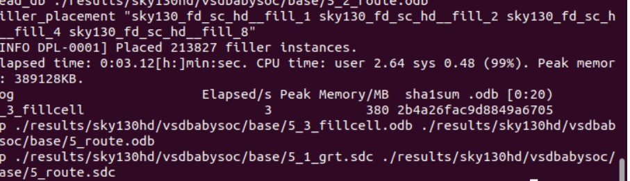

**Routing Result (GUI)**

```shell
make DESIGN_CONFIG=./designs/sky130hd/vsdbabysoc/config.mk gui_route
```
This image shows the **post-routing stage**. The highlighted net `VCO_IN` is fully routed, with its details such as signal type, wire type, and bounding box displayed in the Inspector.

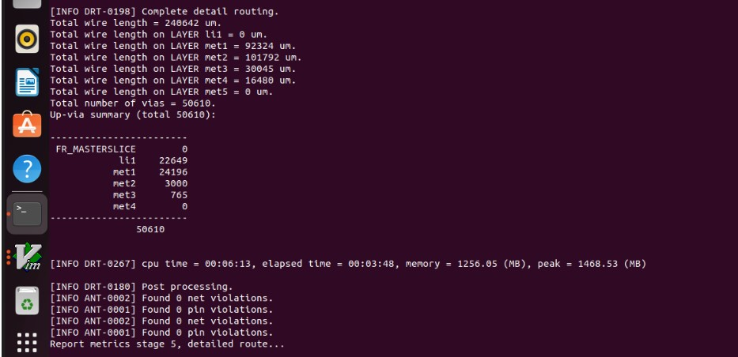


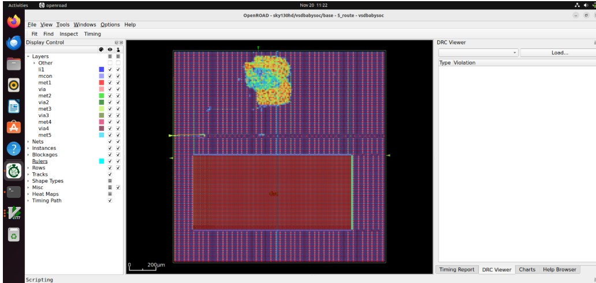

This image shows the **Routing Congestion Heatmap** after the routing stage. Areas with higher congestion are highlighted in **red**, while green regions indicate lower congestion. The highlighted net `_01595_` is fully routed, and its properties such as bounding box and connectivity details are shown in the Inspector.

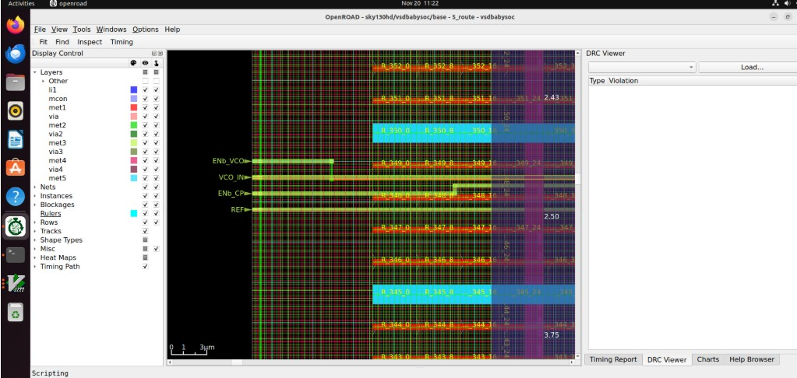

#### <ins>Formula for Congestion:</ins>

The routing congestion percentage is calculated as:

**Congestion (%) = (Used Routing Tracks ÷ Available Routing Tracks) × 100**

Where:
- **Used Routing Tracks** = Number of tracks occupied by wires in a specific region.
- **Available Routing Tracks** = Total routing capacity of that region.

#### <ins>Techniques to Reduce Routing Congestion:</ins>

1. **Increase Core Area / Die Size**
   - Enlarging the die provides more routing tracks and reduces congestion.
   
2. **Adjust Placement Density**
   - Lower the target density during placement to leave whitespace for routing.
   
3. **Add Placement Blockages**
   - Create routing blockages or halos around macros to avoid routing choke points.
   
4. **Cell Padding**
   - Add extra spacing between standard cells to reduce local congestion.
   
5. **Macro Repositioning**
   - Move large macros toward the periphery and keep enough channel spacing.
   
6. **Use Higher Metal Layers**
   - Assign global nets or critical signals to higher metal layers for better routing resources.
   
7. **Routing Layer Adjustment**
   - Allow more routing layers in congested designs.
   
8. **Congestion-Driven Placement**
   - Enable congestion-aware algorithms during placement in the EDA tool.
     
#### <ins>Timing Report after Routing:<ins>

After completing routing, run the following in the OpenROAD GUI → Scripting window:

```shell
report_checks
```

This command provides a detailed timing analysis of critical paths.

In the example below, the design meets timing with Slack = 5.94 ns (MET)

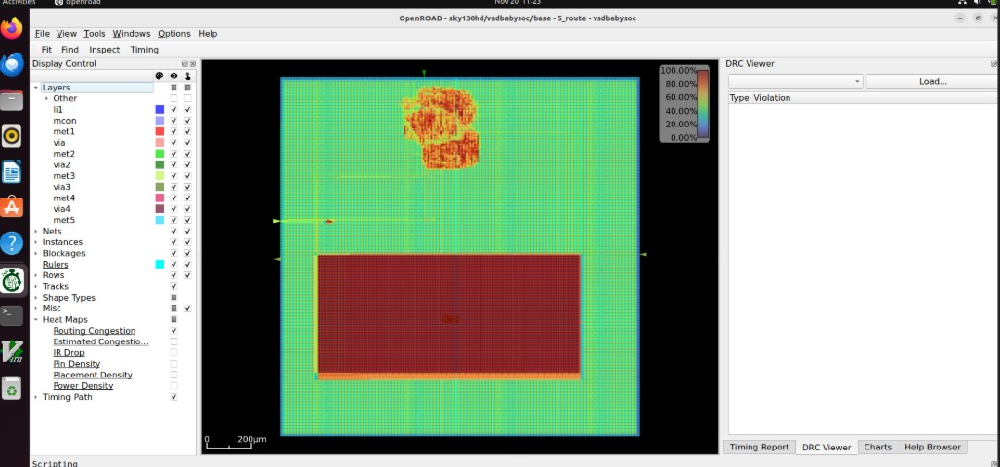

The image shows various **log and JSON files** generated by the OpenROAD flow for each stage (e.g., floorplan, placement, CTS, routing, and filler cell insertion). These files provide detailed execution reports and design data for debugging and analysis.

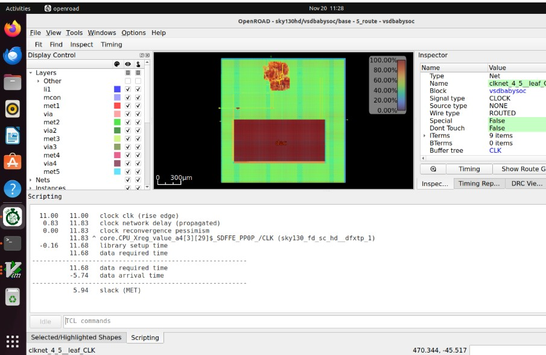

### 🔄 Convert `.odb` to `.def` in OpenROAD

Follow the steps below to export a DEF file from an existing OpenDB (`.odb`) database.

```shell
cd ~/OpenROAD-flow-scripts
source env.sh
cd flow
openroad
# Load the .odb database file
read_db /home/raheem/Desktop/VLSI/OpenROAD-flow-scripts/flow/results/sky130hd/vsdbabysoc/base/5_2_route.odb
# Write out the DEF file
write_def /home/raheem/Desktop/VLSI/OpenROAD-flow-scripts/flow/results/sky130hd/vsdbabysoc/base/5_2_route.def
```
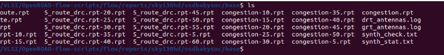

```shell
gvim /home/raheem/Desktop/VLSI/OpenROAD-flow-scripts/flow/results/sky130hd/vsdbabysoc/base/5_2_route.def
```

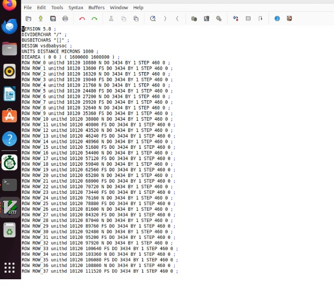

### `VSDBabySoC post_route SPEF generation`

This section covers the step-by-step procedure to generate the **post-route Standard Parasitic Exchange Format (SPEF)** and **post-placement Verilog netlist** for the `VSDBabySoC` design using OpenROAD. These outputs are essential for accurate timing analysis and signoff after the routing stage. The SPEF file captures parasitic RC effects from the physical layout, while the updated Verilog reflects the final net connections post-placement and routing.

### `Step 1: Launch OpenROAD`

Before starting OpenROAD, set up the environment and navigate to the flow directory:

```bash
cd ~/OpenROAD-flow-scripts
source env.sh
cd flow/
openroad
```


### `Step 2: Load Design and Technology Files`

Once inside the OpenROAD shell, run the following commands in sequence to load the required design and technology data for VSDBabySoC:

These files describe the physical dimensions and metal/via layers for standard cells and macros:
```shell
read_lef /home/raheem/Desktop/VLSI/OpenROAD-flow-scripts/flow/designs/sky130hd/vsdbabysoc/lef/sky130hd.lef
read_lef /home/raheem/Desktop/VLSI/OpenROAD-flow-scripts/flow/designs/sky130hd/vsdbabysoc/lef/avsdpll.lef
read_lef /home/raheem/Desktop/VLSI/OpenROAD-flow-scripts/flow/designs/sky130hd/vsdbabysoc/lef/avsddac.lef
```

This file contains timing and power data for the standard cells:
```shell
read_liberty /home/raheem/Desktop/VLSI/OpenROAD-flow-scripts/flow/platforms/sky130hd/lib/sky130_fd_sc_hd__tt_025C_1v80.lib
```

The DEF file represents the post-route physical layout of the design:
```shell
read_def /home/raheem/Desktop/VLSI/OpenROAD-flow-scripts/flow/results/sky130hd/vsdbabysoc/base/5_2_route.def
```


### `Step 3: RC Extraction and Output Generation`

After loading the LEF, Liberty, and DEF files, run the following commands to define the process corner and extract parasitics using the available `.calibre`-format model:

#### 🔹 1. Define Process Corner
Set the process corner using the available Calibre-based extraction rules file:

```tcl
define_process_corner -ext_model_index 0 /home/raheem/Desktop/VLSI/OpenROAD-flow-scripts/external-resources/open_pdks/sky130/openlane/rules.openrcx.sky130A.nom.calibre
```

#### 🔹 2. Extract Parasitics

Run parasitic extraction using the same file:

```shell
extract_parasitics -ext_model_file /home/raheem/Desktop/VLSI/OpenROAD-flow-scripts/external-resources/open_pdks/sky130/openlane/rules.openrcx.sky130A.nom.calibre
```

#### 🔹 3. Write SPEF File
Save the extracted parasitics:

```shell
write_spef /home/raheem/Desktop/VLSI/OpenROAD-flow-scripts/flow/designs/sky130hd/vsdbabysoc/vsdbabysoc.spef
```

#### 🔹 4. Write Post-Placement Verilog Netlist
Save the netlist after placement and routing:

```shell
write_verilog /home/raheem/Desktop/VLSI/OpenROAD-flow-scripts/flow/designs/sky130hd/vsdbabysoc/vsdbabysoc_post_place.v
```

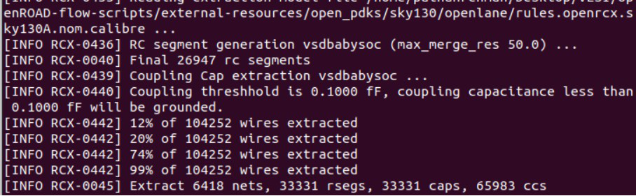

The Standard Parasitic Exchange Format (SPEF) file captures the resistance and capacitance (RC) parasitics of interconnects extracted from the routed layout. This file is essential for accurate post-route static timing analysis (STA) as it models real-world wire delays caused by metal layers and vias. Tools like OpenSTA read the SPEF file to compute timing paths that reflect true physical behavior after routing. Generating and inspecting the SPEF ensures that your design is signoff-ready with precise timing estimates.

```shell
gvim /home/raheem/Desktop/VLSI/OpenROAD-flow-scripts/flow/designs/sky130hd/vsdbabysoc/vsdbabysoc.spef
```

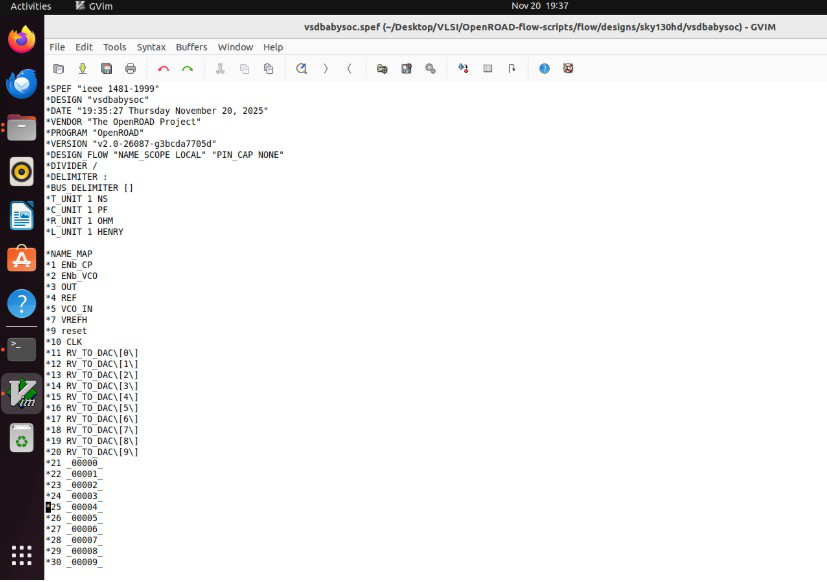

The post-placement Verilog netlist represents the logical connectivity of the design after placement and routing have been completed. This version of the netlist includes any modifications made by optimization or physical synthesis during the backend flow and ensures consistency with the final layout. It is used in downstream verification flows and enables correlation between logical simulation and physical implementation. Writing this netlist is crucial for timing closure and for validating the final connectivity of the design.

```shell
gvim /home/raheem/Desktop/VLSI/OpenROAD-flow-scripts/flow/designs/sky130hd/vsdbabysoc/vsdbabysoc_post_place.v
```

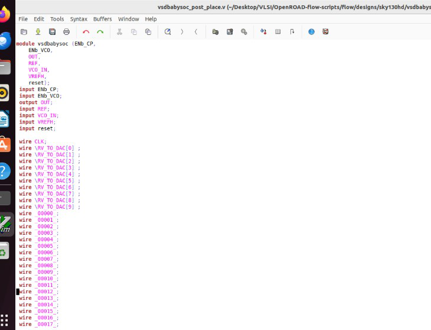
